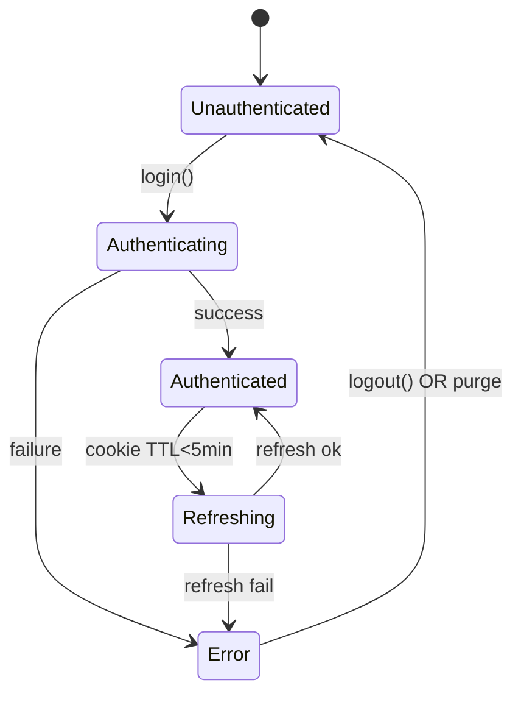

# Auth Module – PassPal

## Purpose

-   Always supply valid SSO Cookie and palapi Firebase ID Token to _core/network_ `AuthInterceptor`.
-   Manage state via Riverpod `Notifier` as a stream: `Unauthenticated → Authenticating → Authenticated(session) → Error(e)`. Used by routing guard & background tasks.
-   Securely store campus ID/PW via `flutter_secure_storage` (AES-256/RSA), keys handled by Keychain (iOS) / Keystore (Android).

---

## Domain Knowledge

| Case              | Detail                                                                      |
| ----------------- | --------------------------------------------------------------------------- |
| Shibboleth SSO    | IdP session expires in 1h.                                                  |
| Auth failure      | SAML missing, HTML login form returns (HTTP 200, not 401).                  |
| Firebase ID Token | REST API requires `Authorization: Bearer <id_token>`.                       |
| Google Org        | Use only `@m.chukyo-u.ac.jp` + `emailVerified=true`. App must check domain. |

---

## Scope

| Includes                                                                                                                                                                 | Excludes                                                                      |
| ------------------------------------------------------------------------------------------------------------------------------------------------------------------------ | ----------------------------------------------------------------------------- |
| Secure save/remove campus ID/PW<br>IdP login & Cookie fetch<br>FirebaseAuth watch & ID Token refresh<br>Session expiry detect & auto re-login (once)<br>AuthState stream | HTTP calls (_core/network_)<br>UI (login screen)<br>Error view (_core/error_) |

---

## Components

| #   | Class               | Role                                    | Depends on         |
| --- | ------------------- | --------------------------------------- | ------------------ |
| 1   | CredentialStorage   | Secure store campus ID/PW               | _core/storage_     |
| 2   | IdpAuthenticator    | HTML POST, redirect, extract Cookie     | dio_cookie_manager |
| 3   | GoogleLinkVerifier  | Ensure FirebaseAuth user domain         | firebase_auth      |
| 4   | AuthFacade          | API: `login/refresh/logout`             | 1, 2, 3            |
| 5   | authStateProvider   | Manage auth state via Riverpod          | Riverpod           |
| 6   | AuthExceptionMapper | Map errors to `AuthenticationException` | _core/error_       |

> Dependency: storage → auth → network/background/routing

---

## State Machine



---

## Main Flows

### 1. Login

1. Google: `FirebaseAuth.signInWithGoogle()` → `GoogleLinkVerifier.ensureLinked()`
2. IdP: `IdpAuthenticator.login(id,pw)` → POST form, extract `Set-Cookie`.
3. Memoize cookie/token, transition to `AuthState.Authenticated`, broadcast event.

### 2. Session Auto-Refresh

-   _core/network_ `AuthInterceptor` checks cookie TTL. If <5 min, calls `AuthFacade.refresh()`.
-   `refresh()` tries silent login with stored ID/PW (once). On success, update cookie. On failure, throw `AuthenticationException`.
-   Exception triggers credential purge, routing guard navigates to `/login`.

### 3. Logout

-   `AuthFacade.logout()`:

    1. `FirebaseAuth.signOut`
    2. `CredentialStorage.purge`
    3. authStateProvider → `Unauthenticated`
    4. Redirect via GoRouter

### 4. Background Task Coop

-   _core/background_ task creates its own `ProviderContainer(overrides:[authStateProvider])`. If not `Authenticated`, runs `refresh()` once.
-   On fail: throw `AuthenticationException`, background retry policy = Give-Up.

---

## Error Handling & core/error

| Failure                        | Exception                                     | Background Retry? |
| ------------------------------ | --------------------------------------------- | ----------------- |
| Wrong ID/PW                    | `AuthenticationException.invalidCredential()` | No (Give-Up)      |
| Cookie expired + re-login fail | `AuthenticationException.sessionExpired()`    | No                |
| Google domain mismatch         | `AccountLinkException`                        | No                |
| Network offline                | `NetworkFailure.offline()`                    | Yes (RetryPolicy) |

All errors sent to `Crashlytics.recordError()`. _core/error_ applies Remote Config kill-switch.

---

## Riverpod Provider Example

```dart
final authFacadeProvider = Provider<AuthFacade>((ref) {
  final cred = ref.watch(credentialStorageProvider);
  final dio  = ref.watch(networkClientProvider(NetworkTarget.sso));
  final fb   = FirebaseAuth.instance;
  return AuthFacade(cred, dio, fb);
});

final authStateProvider = NotifierProvider<AuthStateNotifier, AuthState>(AuthStateNotifier.new);
```

#### Typical usage in Feature

```dart
final state = ref.watch(authStateProvider);
switch (state) {
  case Authenticated(:final session):
    // Inject Cookie to Dio options
    break;
  case Unauthenticated():
    context.go('/login');
}
```

---

## Security Notes

-   Minimize plaintext keys in memory. Accept ID/PW as `Uint8List`, encrypt ASAP, clear with `fillRange(0)` on dispose.
-   ID Token is auto-refreshed by Firebase SDK every 60 min. AuthFacade monitors token staleness.

---

## Test Strategy

| Type        | Test                                                                               |
| ----------- | ---------------------------------------------------------------------------------- |
| Unit        | IdpAuthenticator detects HTML login (200), throws error                            |
| Widget      | Login → GoRouter redirects to `/setup/*`                                           |
| Integration | WorkManager test: after 1h, interceptor calls refresh; success/fail path validated |

---

## Directory Structure

```
lib/core/auth/
 ├─ facade/auth_facade.dart
 ├─ models/auth_session.dart
 ├─ idp/idp_authenticator.dart
 ├─ google/google_link_verifier.dart
 ├─ providers/auth_state_notifier.dart
 └─ errors/auth_exception.dart
```
