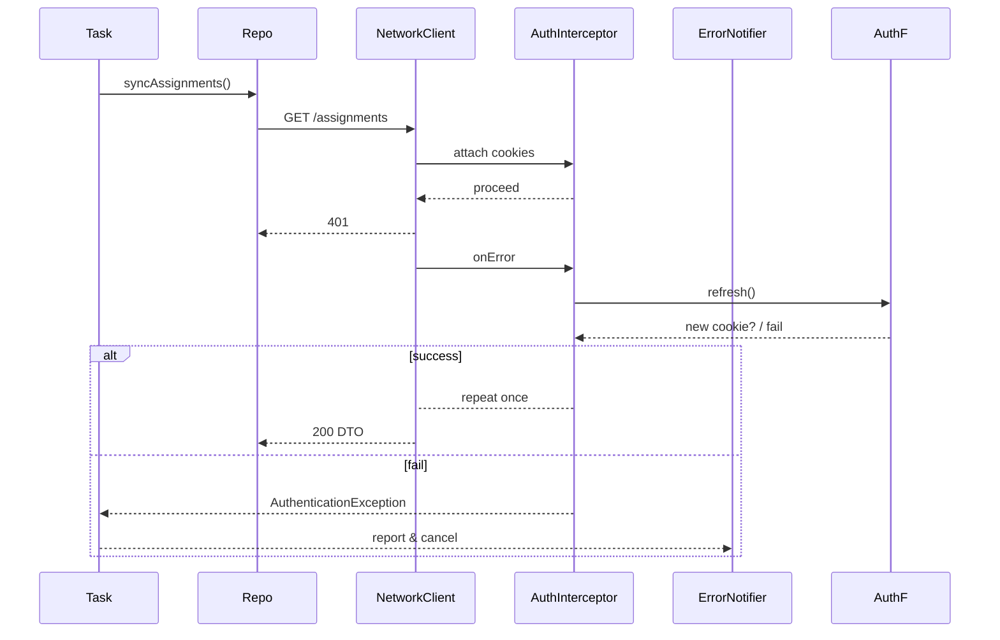

## Summary

The background layer is redesigned to ensure **always delivering fresh data without any user action**, while addressing:

-   **Platform constraints** (Doze mode / BGTaskScheduler minimum intervals)
-   **Session maintenance flow** (integration with AuthInterceptor)
-   **Error & retry strategy** (exponential backoff + jitter)
-   **DI and task uniqueness control via Riverpod**

With this setup, each feature can safely implement “register task → invoke Repository” logic to sync diffs and trigger notifications.

---

## 1. Scope & Responsibilities

| Area                            | Included                                                                 | Excluded                                        |
| ------------------------------- | ------------------------------------------------------------------------ | ----------------------------------------------- |
| **Task registration API**       | `BackgroundTaskScheduler.scheduleOneShot/Periodic/registerUnique/cancel` | Direct UI actions                               |
| **Platform abstraction**        | `AndroidScheduler` (WorkManager), `IosScheduler` (BGTaskScheduler)       | OS-level settings UI                            |
| **Push ⇄ Task bridge**          | `PushToTaskBridge`: runs FCM data messages (`"task":…`) immediately      | Notification layout                             |
| **Retry / exponential backoff** | `RetryPolicy` (1 min→2→5→15 …, ±30 % jitter)                             | Network-layer retries (handled by core/network) |
| **Crashlytics integration**     | Report success/failure and duration as non-fatal logs                    | ANR debug UI                                    |

---

## 2. Behavior

### 2.1 Android 14 / WorkManager compliance

-   Respect **minimum interval of 15 min** for `PeriodicWorkRequest`. Use _high‑priority FCM_ for shorter triggers.
-   Use `ExpeditedWorkRequest` only for **notification taps** or **immediate widget update**, to conserve OS quotas.
-   Avoid Doze restrictions by using `setRequiredNetworkType(NOT_ROAMING)` and wake via high-priority FCM.

### 2.2 iOS 17 / BGTaskScheduler

-   OS determines window of **15 min–6 h** for `BGAppRefreshTask`. Set fallback to 6 h.
-   Ensure `requiresNetworkConnectivity = true` so tasks restore after app restart.

### 2.3 Enhanced retry policy

-   Use exponential backoff + jitter to prevent spike load.
-   **Give up immediately** on `AuthenticationException` or `MaintenanceException`.
    AuthInterceptor retries once; if it fails, **task fails & cancels**.

### 2.4 Riverpod + Isolate integration

-   During task execution, use `ProviderContainer(overrides: [...])` to inject dependencies safely into separate isolate.
-   `taskHandlerProvider` (family) ensures **feature → core dependency inversion**, enabling `FakeScheduler` substitution in tests.

### 2.5 Crashlytics & Remote Config

-   Log `start`/`finish` as breadcrumbs for each task; tagging ANRs helps faster debugging.
-   Use Remote Config flags as dynamic kill-switch to disable problematic parsers or flows.

---

## 3. Component Breakdown

| #   | Class                       | Primary Responsibility                                            | Dependencies       |
| --- | --------------------------- | ----------------------------------------------------------------- | ------------------ |
| 1   | **BackgroundTaskScheduler** | Provide abstract API; inject platform scheduler via `family`      | Riverpod           |
| 2   | **AndroidScheduler**        | WorkManager wrapper (`OneTimeWorkRequest`, `PeriodicWorkRequest`) | workmanager        |
| 3   | **IosScheduler**            | BGTaskScheduler wrapper (`registerForRefresh`, `submitTask`)      | bg_task            |
| 4   | **RetryPolicy**             | Compute delay with exponential & jitter                           | dart\:math         |
| 5   | **TaskDispatcher**          | Parse JSON args, call handler, manage timeout                     | core/error         |
| 6   | **PushToTaskBridge**        | Map FCM data messages to `executeNow()`                           | firebase_messaging |
| 7   | **DebugConsole**            | Provide `runTaskNow()` via DeveloperMenu                          | flutter/foundation |

**Interceptor order**:
Repository → core/network (Connectivity → Auth → Retry…) → TaskDispatcher → RetryPolicy → Crashlytics
\> Network-layer retry runs first, then the Task layer controls full re-execution.

---

## 4. Usage Example (syncing assignments)

```dart
final syncAssignmentsTask = BackgroundTask(
  id: 'assignments.sync',
  periodic: const Duration(hours: 6), // fallback window
  initialDelay: const Duration(minutes: 15),
  constraints: const TaskConstraints(networkRequired: true),
  handler: (ctx) async {
    final repo = ctx.read(assignmentsRepositoryProvider);
    await repo.syncAssignments(); // uses TTL logic & SWR
  },
);

await ref
  .read(backgroundSchedulerProvider)
  .registerUnique(syncAssignmentsTask);
```

On the repository side, check TTL (1h for assignment list) in local storage, fetch only if stale, then upsert to DB.

---

## 5. Error Handling & Retry Flow



-   On success → `Result.success()`
-   On failure → `RetryPolicy` schedules next run
-   `MaintenanceException` handled via the same routing guard logic as UI layer

---

## 6. Testing & CI

| Test Type       | Coverage                                                                 |
| --------------- | ------------------------------------------------------------------------ |
| **Unit**        | `RetryPolicy` calculations, duplicate tag prevention in AndroidScheduler |
| **Widget**      | Notification tap → DeepLink → immediate Task execution → UI update       |
| **Integration** | WorkManager TestDriver: test 401→auto-relogin→success and failure cases  |
| **Golden**      | Regression testing for maintenance screen routing + Guard                |
