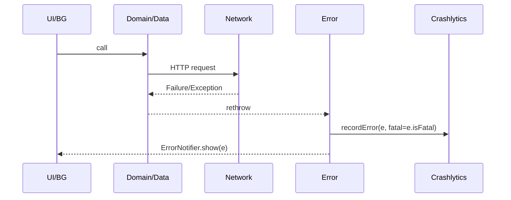

# core/error — Architecture Instructions

## 1. Purpose

-   Provide a **single, unified error model** across all layers (UI, BG, domain).
-   Centralize error handling, classification, and recovery—**no duplicated recovery logic**.
-   Integrate Crashlytics + Remote Config for observability and kill-switch (disable features on parsing errors).

---

## 2. Domain Mapping

| Case              | Action                                                        | Owner             |
| ----------------- | ------------------------------------------------------------- | ----------------- |
| 401 re-auth fail  | Purge credentials, route to Unauthenticated                   | auth → error      |
| 503 maintenance   | Throw `MaintenanceException`, route to /maintenance           | network → routing |
| Offline           | Throw `NetworkFailure.offline()`, show retry button           | network           |
| Parse failure     | Send `ParseFailure` to Crashlytics, kill-switch parser via RC | error             |
| BG task exception | Delegate to RetryPolicy, give up for Auth/Maintenance         | background        |

---

## 3. Scope

Included:

-   Global uncaught exception catching (`runZonedGuarded`, `PlatformDispatcher.onError`)
-   Exception hierarchy (`AppException` & children)
-   Crashlytics/logger integration
-   Remote Config kill-switch
-   UI/BG unified error notifier

Excluded:

-   Dio → Failure mapping (done in core/network)
-   Domain validation failures (`Either<Failure, T>`)

---

## 4. Error Model

```dart
abstract class AppException implements Exception {
  final String message;
  final StackTrace? stack;
  final bool isFatal;
}
class NetworkFailure extends AppException { /* kind: offline, 4xx, 5xx, etc. */ }
class AuthenticationException extends AppException {}
class MaintenanceException extends AppException {}
class ParseFailure extends AppException {}
class UnknownException extends AppException {}
```

-   `NetworkFailure.kind = offline | http4xx | server5xx`
-   `canRetry: bool` (set by RetryInterceptor)

#### Mapping Rules

| Input (network)               | To Error Type            | Notes                   |
| ----------------------------- | ------------------------ | ----------------------- |
| Dio timeout / unknown         | NetworkFailure.offline() | ConnectivityInterceptor |
| HTTP 503 + "maintenance" body | MaintenanceException     | MaintenanceInterceptor  |
| HTTP 5xx (after 3 retries)    | NetworkFailure.server()  | RetryInterceptor        |
| HTTP 4xx except 401           | NetworkFailure.http()    | Not retryable           |
| 2nd 401 (after retry)         | AuthenticationException  | AuthInterceptor         |

---

## 5. Catching & Reporting



-   **BG tasks:** TaskDispatcher receives AppException, delegates to RetryPolicy.
-   **UI:** ErrorOverlay displays snackbar/dialog. On fatal, show restart dialog.

---

## 6. Remote Config Kill-Switch

| Key                           | Description                                | Impact           |
| ----------------------------- | ------------------------------------------ | ---------------- |
| disable_assignments_parser_v1 | If true, disable v1 parser on ParseFailure | assignments/data |
| force_update_min_version      | If below, throw UpdateRequiredException    | routing guard    |

-   `RemoteKillSwitch` caches values for 15min, referenced in ErrorGuard.

---

## 7. UI API Example

```dart
final errorNotifierProvider =
    NotifierProvider<ErrorNotifier, AppErrorState>(ErrorNotifier.new);

// Usage in UI
switch (state) {
  case Showing(AppException e):
    return ErrorOverlay(exception: e);
  case Idle():
    return const SizedBox.shrink();
}
```

-   `ErrorOverlay` must include **Retry button** and **FAQ link**.
-   On `NetworkFailure.offline()`, show “Waiting for reconnection” toast.

---

## 8. Background Task Coordination

| Exception               | RetryPolicy       | Task Result                  |
| ----------------------- | ----------------- | ---------------------------- |
| NetworkFailure.server() | Yes (exponential) | Result.retry()               |
| AuthenticationException | No                | Result.failure(giveUp: true) |
| MaintenanceException    | No                | Result.failure(giveUp: true) |
| ParseFailure            | No (kill-switch)  | Result.success() + log only  |

-   **Do not block user ops on parser error—log only.**

---

## 9. Logging Utility

| Output          | Build Type    | Format                                |
| --------------- | ------------- | ------------------------------------- |
| Crashlytics     | release/debug | exception_type, network.kind, task.id |
| console (`log`) | debug only    | \[color tag] + message                |
| file (opt)      | dev toggle    | timestamped JSON Lines                |

---

## 10. Test Strategy

| Type        | Test                                      |
| ----------- | ----------------------------------------- |
| Unit        | AppException → Crashlytics params         |
| Widget      | ErrorNotifier shows only one overlay      |
| Integration | BG: NetworkFailure/server = auto-retry    |
| Golden      | MaintenanceGuard shows no overlay overlap |

---

## 11. File Structure

```
lib/core/error/
 ├─ error_guard.dart
 ├─ app_exception.dart
 ├─ crashlytics_reporter.dart
 ├─ remote_kill_switch.dart
 ├─ error_notifier.dart
 └─ overlay/
```

---

## 12. Integration Hooks

| Core       | Hook / Impact                                            |
| ---------- | -------------------------------------------------------- |
| network    | MaintenanceInterceptor → MaintenanceException            |
| background | TaskDispatcher catches AppException, applies RetryPolicy |
| auth       | 2nd auth fail → AuthenticationException, triggers purge  |
| routing    | MaintenanceGuard on MaintenanceException → /maintenance  |

---

**Note:**

-   All error handling must be testable/mocked via Riverpod providers.
-   Update mapping/tests if introducing new error types.
