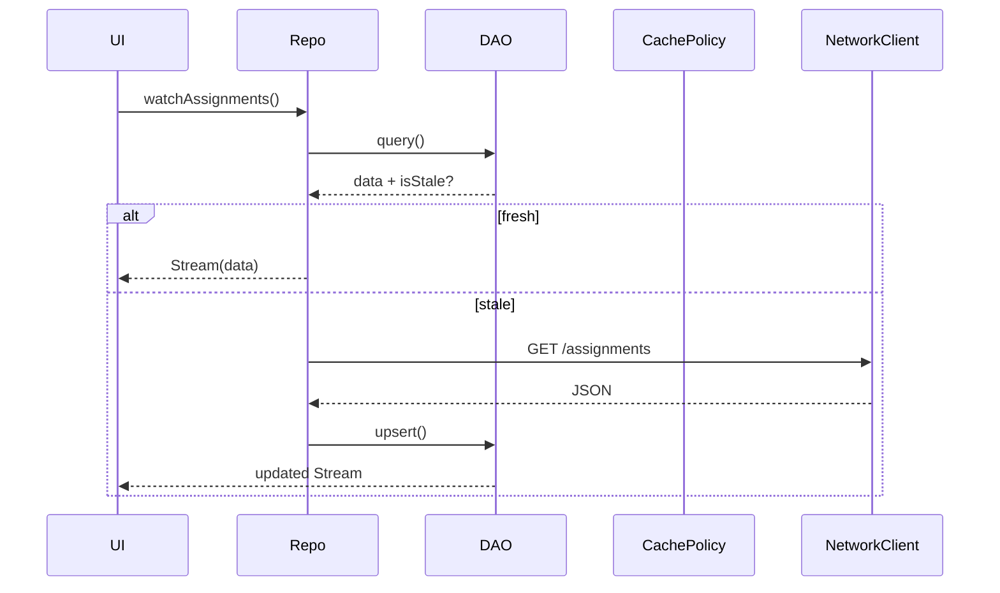

# Storage & Caching Strategy (Summary)

**Storage is the Single Source of Truth. Achieve both speed and freshness via SWR (stale-while-revalidate) + TTL. Separate three layers: Credential → Secure, Cache → SQLite, Pref → Key-Value.**

-   Use `flutter_secure_storage` (AES-256) for campus ID/PW & SSO Cookie.
-   Use Floor + sqflite for data cache (stream-based).
-   Use lightweight Key-Value for user prefs.
-   DB corruption or TTL expiry maps to _core/error_’s Failure class.
-   _core/background_ ensures re-sync with exponential backoff.

---

## 1. Goals & Principles

1. **Security:** Credentials encrypted (AES-256) via Keychain/Keystore.
2. **Consistency:** Upper layers access data only via storage API, never direct SQLite.
3. **Observability:** Non-fatal exceptions sent to Crashlytics, linked to RemoteConfig Kill-Switch.
4. **Testability:** Use `sqflite_common_ffi` for mockable, device-independent CI.

---

## 2. Scope & Responsibility

| Layer            | Includes                          | Excludes                     |
| ---------------- | --------------------------------- | ---------------------------- |
| Credential Store | ID/PW/Cookie save/expire/wipe     | FirebaseAuth ops (core/auth) |
| Database Gateway | DAO, migrations, streams          | HTML/JSON parsing            |
| Cache Policy     | TTL check, SWR flags              | Network fetch                |
| Preferences      | Theme, notifications, campus info | UI rendering logic           |

---

## 3. Architecture

### 3.1 CredentialStorage

```dart
abstract interface class CredentialStorage {
  Future<void> save(Credentials);
  Future<Credentials?> read();
  Future<void> purge();
}
```

-   Implementation: `FlutterSecureStorageCredentialStorage`.
-   On Android, AES key is wrapped with RSA/Keystore. On iOS, use Keychain.
-   Always call `purge()` from _core/auth_’s `logout()`.

### 3.2 AppDatabase

-   **Driver:** sqflite
-   **ORM:** Floor – DAOs expose `Stream<List<T>>`.
-   **Migrations:** `onUpgrade()` + versioned SQL; automatic by sqflite.
-   **Entities:** Use Freezed for `@JsonKey` & `copyWith`.
-   **Corruption:** On open-fail, trigger `StorageException.corrupted()`, log to Crashlytics, and auto-recreate DB.

### 3.3 CachePolicy (TTL + SWR)

-   DAO has `lastFetchedAt`.
-   On repo fetch, judge `isStale(now)`.
-   If stale: fetch remote, upsert, emit stream.
-   If fresh: return immediately, trigger background revalidation.
-   Follows Web `stale-while-revalidate` pattern.

### 3.4 UserPrefs

-   Implementation: `SharedPreferencesPrefs`.
-   Riverpod’s `userPrefsProvider` issues theme mode, etc.

---

## 4. Data Lifecycle



-   CachePolicy manages `isStale` judgment.
-   _core/background_ runs periodic updates (15min–6h as per OS limit).

---

## 5. Error Handling & _core/error_

| Event           | Exception                      | _core/error_ Mapping                 |
| --------------- | ------------------------------ | ------------------------------------ |
| DB corruption   | `StorageException.corrupted()` | `UnknownException` (fatal=false)     |
| Migration fail  | `MigrationException`           | `MigrationException` → /force-update |
| SecureStore I/O | `StorageException.secureIo()`  | `NetworkFailure.offline()`-like      |

All are non-fatal and sent to `FirebaseCrashlytics.instance.recordError()`.

---

## 6. Test Strategy

| Layer       | Tool                  | Focus                                    |
| ----------- | --------------------- | ---------------------------------------- |
| Credential  | fake in-memory impl   | Verify purge() works                     |
| DAO         | sqflite_common_ffi    | Unit tests run device-less               |
| CachePolicy | fake clock            | TTL → isStale check                      |
| Integration | WorkManager/BGTaskDrv | TTL expiry → BGTask → DB upsert → Stream |

---

## 7. DI & Providers

```dart
final appDatabaseProvider = Provider<AppDatabase>((ref) {
  final path = ref.watch(databasePathProvider);
  return $FloorAppDatabase
      .databaseBuilder(path)
      .addMigrations(allMigrations)
      .build();
});

final credentialStorageProvider =
    Provider<CredentialStorage>((_) => FlutterSecureStorageCredentialStorage());

final cachePolicyProvider =
    Provider<CachePolicy>((ref) => DefaultCachePolicy(ref.watch(clockProvider)));
```

-   For tests, use `ProviderContainer(overrides:[appDatabaseProvider.overrideWithValue(fakeDb), ...])`
-   Use Riverpod v2.4+ `overrideWith`.

---

## 8. TTL Reference

| Entity                | TTL  | Update Trigger          |
| --------------------- | ---- | ----------------------- |
| Timetable             | 24 h | BGTask 6h, widget open  |
| Period Master         | 3 d  | BGTask                  |
| Bus Timetable         | 3 d  | BGTask                  |
| Assignments/Materials | 1 h  | User open, push, BGTask |
| Absence Log           | 24 h | User open               |
| Announcements         | 1 h  | User open               |

-   TTLs are dynamic via RemoteConfig.
-   Change → invalidate existing records’ `lastFetchedAt`.

---

## 9. Folder Structure

```
lib/core/storage/
 ├─ secure/credential_storage.dart
 ├─ db/app_database.dart
 │   └─ migrations/
 ├─ cache_policy/cache_policy.dart
 ├─ prefs/user_prefs.dart
 ├─ models/ (freezed)
 └─ errors/storage_exception.dart
```
