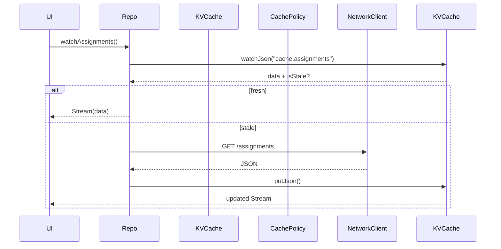

# Storage Layer Instructions

## Summary

* Enforce **Single Source of Truth** with SWR (stale-while-revalidate) + TTL for fast and fresh UI.
* Split into three clear layers:

  * **Credential**: Secure, encrypted storage
  * **Cache**: Key-Value store for data JSON
  * **Pref**: Lightweight settings (also key-value)

---

## 0. Overview

* Store campus ID/PW and SSO cookies via **flutter\_secure\_storage** (AES-256).
* Use **SharedPreferences** for all cache (JSON-serialized) and user prefs, separated by namespace.
* Data is streamed/reactive via Riverpod `StreamProvider`.
* TTL expiry or deserialization errors are mapped to *core/error*.
* *core/background* handles automatic re-sync with backoff.

---

## 1. Principles

1. **Security:** Credentials encrypted in Keychain/Keystore (AES-256).
2. **Consistency:** No direct SharedPreferences usage in features; use Storage Facade.
3. **Observability:** All exceptions sent to Crashlytics and respect RemoteConfig kill-switches.
4. **Testability:** Use `shared_preferences_mocks` and fake impls for pure CI runs.

---

## 2. Scope & Responsibility

| Layer            | Handles                               | Does NOT handle          |
| ---------------- | ------------------------------------- | ------------------------ |
| Credential Store | ID/PW/Cookie save, expire, wipe       | FirebaseAuth (core/auth) |
| Key-Value Cache  | JSON encode/decode, namespace, stream | HTML/JSON parsing        |
| Cache Policy     | TTL, SWR flag                         | Network fetch            |
| Preferences      | Theme, notification, campus           | UI rendering logic       |

---

## 3. Architecture

### 3.1 CredentialStorage

```dart
abstract interface class CredentialStorage {
  Future<void> save(Credentials value);
  Future<Credentials?> read();
  Future<void> purge();
}
```

Impl: `FlutterSecureStorageCredentialStorage`

---

### 3.2 KeyValueCache

```dart
abstract interface class KeyValueCache {
  Future<void> putJson(String key, Map<String, dynamic> value);
  Stream<Map<String, dynamic>?> watchJson(String key);
  Future<void> remove(String key);
}
```

Impl: `SharedPrefsKeyValueCache`

* Namespace: `cache.<entity>`
* Always include `lastFetchedAt` for TTL.

**Stream Tips:**

* SharedPreferences is not reactive; wrap updates via `StreamController` or `ValueNotifier` + `Stream`.
* Bind UI using Riverpod `StreamProvider`.

---

### 3.3 CachePolicy (TTL + SWR)

* Use `lastFetchedAt` in cache for staleness check.
* SWR logic as before.

---

### 3.4 UserPrefs

```dart
abstract interface class UserPrefs {
  ThemeMode get theme;
  Future<void> setTheme(ThemeMode mode);
  String? get campus;
  Future<void> setCampus(String value);
  // ...other settings
}
```

Impl: `SharedPrefsUserPrefs` (namespace: `pref.*`)

---

## 4. Data Lifecycle (SWR Example)



---

## 5. Error Handling

| Event            | Exception                        | core/error Mapping             |
| ---------------- | -------------------------------- | ------------------------------ |
| JSON decode fail | `StorageException.deserialize()` | `UnknownException` (non-fatal) |
| SecureStore I/O  | `StorageException.secureIo()`    | `NetworkFailure.offline()`     |
| SharedPrefs I/O  | `StorageException.kvIo()`        | Retry as per NetworkFailure    |

* Always report to `FirebaseCrashlytics.instance.recordError()`.

---

## 6. Testing

| Layer       | Tool                       | Main Check                |
| ----------- | -------------------------- | ------------------------- |
| Credential  | Fake in-memory impl        | `purge()` reliability     |
| KV Cache    | shared\_preferences\_mocks | putJson/watchJson correct |
| CachePolicy | Fake clock                 | TTL → isStale logic       |
| Integration | BGTaskScheduler test       | BG sync/stream update     |

---

## 7. DI & Providers

```dart
final sharedPrefsProvider = Provider<SharedPreferences>((_) => throw UnimplementedError());
final keyValueCacheProvider = Provider<KeyValueCache>((ref) {
  final prefs = ref.watch(sharedPrefsProvider);
  return SharedPrefsKeyValueCache(prefs);
});
final credentialStorageProvider = Provider<CredentialStorage>((_) => FlutterSecureStorageCredentialStorage());
final cachePolicyProvider = Provider<CachePolicy>((ref) => DefaultCachePolicy(ref.watch(clockProvider)));
```

**Entrypoint:**

```dart
final prefs = await SharedPreferences.getInstance();
final container = ProviderContainer(overrides: [
  sharedPrefsProvider.overrideWithValue(prefs),
]);
```

---

## 8. TTL Reference

| Entity          | TTL  | Trigger           |
| --------------- | ---- | ----------------- |
| Timetable       | 24 h | BGTask 6h, widget |
| Period Master   | 3 d  | BGTask            |
| Bus Timetable   | 3 d  | BGTask            |
| Assignments/etc | 1 h  | User open/push/BG |
| Absence Log     | 24 h | User open         |
| Announcements   | 1 h  | User open         |

---

## 9. Folder Structure

```
lib/core/storage/
 ├─ secure/credential_storage.dart
 ├─ kv/key_value_cache.dart
 ├─ cache_policy/cache_policy.dart
 ├─ prefs/user_prefs.dart
 ├─ models/ (freezed json models)
 └─ errors/storage_exception.dart
```
