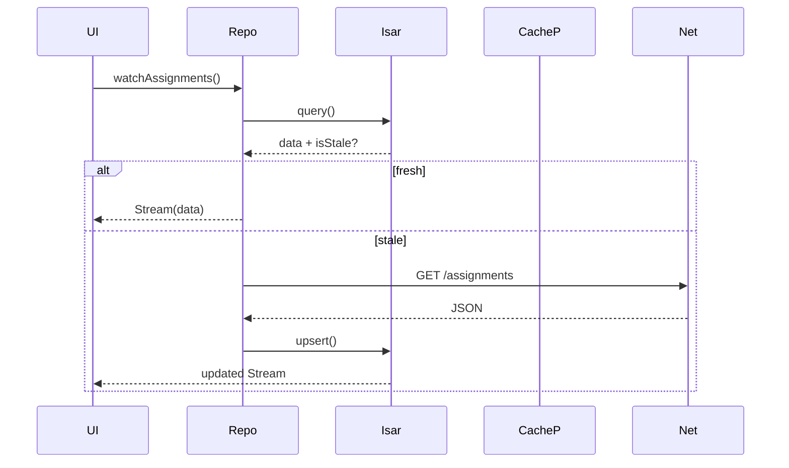

# Storage Architecture — Passpal

Follow these rules for all storage code.

---

## 1. Goals & Principles

-   Use **flutter_secure_storage** (AES-256) for campus credentials (ID/PW, SSO cookie).
-   All higher layers access storage only via APIs—never raw DB.
-   Send all storage exceptions to Crashlytics as non-fatal; support kill-switch via RemoteConfig.
-   All storage must be testable (CI: isar_test + isar_flutter_libs).

---

## 2. Layer Responsibilities

| Layer            | Responsibilities                  | Not responsible for |
| ---------------- | --------------------------------- | ------------------- |
| Credential Store | Store, expire, wipe ID/PW/cookies | FirebaseAuth ops    |
| Database Gateway | Isar schema, instance, streams    | HTML/JSON parsing   |
| Cache Policy     | TTL, SWR flag, staleness          | Network fetch       |
| Preferences      | Theme, notification, campus info  | UI rendering        |

---

## 3. Architecture

### 3.1 CredentialStorage

```dart
abstract interface class CredentialStorage {
  Future<void> save(Credentials data);
  Future<Credentials?> read();
  Future<void> purge();
}
```

-   Implementation: `FlutterSecureStorageCredentialStorage`
-   Android: Keystore; iOS: Keychain.

---

### 3.2 AppDatabase (**PasspalIsar**)

| Item         | Details                                                                              |
| ------------ | ------------------------------------------------------------------------------------ |
| Driver       | Isar (Native)                                                                        |
| Dependencies | isar, isar_flutter_libs, build_runner, isar_generator                                |
| Entity       | @collection + @Index(); use Freezed for copyWith/json                                |
| Migration    | Auto-detect schema; open with migration callback; breaking changes: clear + resync   |
| Reactive     | `collection.watchLazy(fireImmediately: true)` → Riverpod                             |
| Encryption   | 32-byte key from SecureStorage                                                       |
| Corruption   | Open fail → `StorageException.corrupted()` → Crashlytics → delete dir and regenerate |

#### Example Entity

```dart
@collection
class AssignmentEntity {
  Id id = Isar.autoIncrement;
  @Index(unique: true) late String manaboId;
  late String title;
  DateTime? openAt;
  DateTime? dueAt;
  @Enumerated(EnumType.name)
  late AssignmentStatus status;
  DateTime lastFetchedAt = DateTime.now();
}
```

---

### 3.3 CachePolicy (TTL + SWR)

-   Every entity has `lastFetchedAt`.
-   Repo evaluates `isStale(now)`.
-   If stale: fetch remote, upsert, notify UI.
-   If fresh: serve from cache, trigger background revalidate (SWR).

---

### 3.4 UserPrefs

-   Use `SharedPreferencesPrefs`.
-   Expose via Riverpod Notifier (e.g., ThemeMode).

---

## 4. Data Lifecycle



---

## 5. Error Handling & _core/error_

| Case            | Exception                      | _core/error_ Mapping                 |
| --------------- | ------------------------------ | ------------------------------------ |
| DB Corruption   | `StorageException.corrupted()` | `UnknownException` (fatal=false)     |
| Schema Mismatch | `IsarError`                    | `MigrationException` → /force-update |
| SecureStore I/O | `StorageException.secureIo()`  | `NetworkFailure.offline()`           |

All errors: record to Crashlytics as non-fatal.

---

## 6. Testing Strategy

| Layer       | Tool                   | What to Test          |
| ----------- | ---------------------- | --------------------- |
| Credential  | Fake impl              | Purge correctness     |
| DAO         | isar_test (in-memory)  | Query, watch          |
| CachePolicy | Fake clock             | TTL/isStale logic     |
| Integration | BGTaskScheduler Driver | BGTask, upsert on TTL |

---

## 7. DI & Providers

```dart
final isarProvider = Provider<Isar>((ref) {
  final dir = ref.watch(appDocDirProvider);
  final key = ref.watch(dbKeyProvider); // 32 bytes
  return Isar.open(
    [AssignmentEntitySchema, ...],
    directory: dir.path,
    encryptionKey: key,
    inspector: kDebugMode,
    name: 'passpal',
  );
});

final assignmentDaoProvider = Provider<AssignmentDao>((ref) {
  final isar = ref.watch(isarProvider);
  return AssignmentDao(isar);
});
```

-   For tests: override providers with in-memory instance.

---

## 8. TTL Settings

| Entity        | TTL  | Refresh Trigger           |
| ------------- | ---- | ------------------------- |
| Timetable     | 24 h | BGTask 6h + widget open   |
| Period Master | 3 d  | BGTask                    |
| Bus Timetable | 3 d  | BGTask                    |
| Assignments   | 1 h  | User open / Push / BGTask |
| Absence Log   | 24 h | User open                 |
| Announcements | 1 h  | User open                 |

-   TTL is managed via RemoteConfig; on change, invalidate current `lastFetchedAt`.

---

## 9. Folder Structure

```
lib/core/storage/
 ├─ secure/credential_storage.dart
 ├─ isar/
 │   ├─ schemas/
 │   ├─ daos/assignment_dao.dart
 │   └─ passpal_isar.dart
 ├─ cache_policy/cache_policy.dart
 ├─ prefs/user_prefs.dart
 ├─ models/ (freezed)
 └─ errors/storage_exception.dart
```

---

**End of instruction.**
Keep logic DRY, testable, and fully decoupled from UI.
When in doubt, follow Clean Architecture and use Riverpod for all injection.
