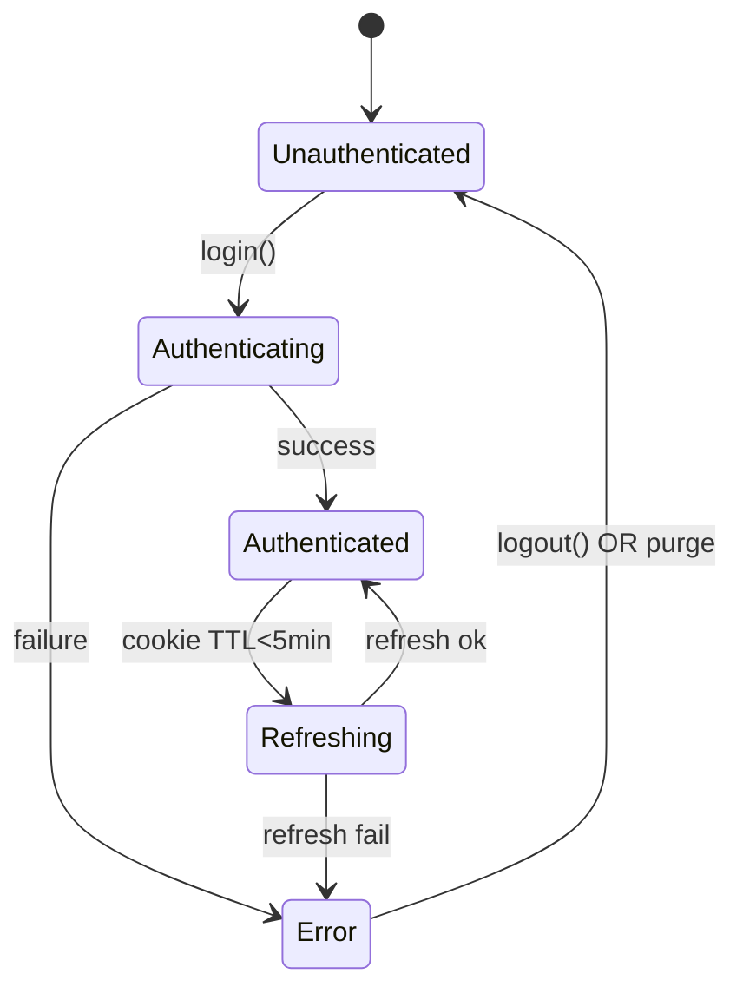

# ADR-0005: Core Auth Architecture

## ステータス

承認済み

## コンテキスト

PassPalアプリは中京大学の複数のポータル（MaNaBo、ALBO、Cubics）に対する統合認証が必要です。
各ポータルはShibboleth SSOを使用しており、認証フローは共通ですが、エンドポイントURLが異なります。

### 要件

1. 複数ポータルの統合認証（SSO Cookie管理）
2. Firebase ID Token管理（REST API用）
3. 認証状態の一元管理（Riverpod）
4. セキュアな認証情報保存（AES-256）
5. セッション自動リフレッシュ
6. core/network、core/storageとの連携

## 決定

### アーキテクチャ

```text
lib/core/auth/
 ├─ facade/auth_facade.dart           # 認証API統合
 ├─ models/auth_session.dart          # 認証セッション情報
 ├─ idp/idp_authenticator.dart        # SSO認証処理
 ├─ google/google_link_verifier.dart  # Google認証ドメイン検証
 ├─ providers/auth_state_notifier.dart # 状態管理
 └─ errors/auth_exception.dart        # 認証例外
```

### 主要コンポーネント

1. **IdpAuthenticator**: 共通SSO認証処理（URL切り替え対応）
2. **AuthFacade**: login/refresh/logoutのAPI提供
3. **AuthStateNotifier**: Riverpod状態管理
4. **GoogleLinkVerifier**: 大学ドメイン検証
5. **AuthSession**: 認証済みセッション情報

### 状態管理



### 例外階層

- `AuthenticationException.invalidCredential()`: ID/PW間違い
- `AuthenticationException.sessionExpired()`: セッション期限切れ
- `AccountLinkException`: Googleドメインミスマッチ
- `NetworkFailure`: ネットワークエラー（既存）

## 実装状況

✅ **完了済み**

### 実装されたコンポーネント

1. **認証例外** (`errors/auth_exception.dart`)
   - `AuthenticationException`: 認証関連エラー
   - `AccountLinkException`: アカウントリンクエラー

2. **認証セッション** (`models/auth_session.dart`)
   - Freezedによる不変オブジェクト
   - Cookie管理、有効期限チェック機能

3. **IdP認証** (`idp/idp_authenticator.dart`)
   - 複数ポータル対応（ALBO/MaNaBo/Cubics）
   - 共通SAML認証フロー

4. **Google認証検証** (`google/google_link_verifier.dart`)
   - 大学ドメイン検証
   - Firebase ID Token管理

5. **認証ファサード** (`facade/auth_facade.dart`)
   - login/refresh/logout API
   - セッション復元機能

6. **状態管理** (`providers/auth_state_notifier.dart`)
   - Riverpod Notifier
   - 状態遷移管理

7. **プロバイダー** (`providers/auth_providers.dart`)
   - 全コンポーネントのDI設定

8. **認証インターセプター** (`network/auth_interceptor.dart`)
   - 自動認証ヘッダー追加
   - セッション自動リフレッシュ

### テスト実装

- 基本テストケース（IdpAuthenticator）
- 例外伝播テスト
- Mockitoによるモック生成

## 根拠

### SSO認証の共通化

各ポータルのSAML認証フローは同一のため、URLのみ切り替える共通実装を採用。
これによりコード重複を排除し、保守性を向上。

### core/network連携

認証処理でもDio/CookieJarはnetwork層のProviderから注入し、
AuthInterceptorが自動リフレッシュを制御する設計。

### core/storage連携

認証情報の暗号化保存はCredentialStorageインターフェースを利用し、
AES-256による安全な永続化を実現。

## 影響

### 正の影響

- 統一された認証状態管理
- セキュアな認証情報保存
- 自動セッション管理
- テスト容易性

### 負の影響

- 初期実装の複雑性
- core間の依存関係

## Feature層での利用例

### UI層での認証状態監視

```dart
class HomePage extends ConsumerWidget {
  @override
  Widget build(BuildContext context, WidgetRef ref) {
    final authState = ref.watch(authStateProvider);
    
    return switch (authState) {
      Authenticated(:final session) => MainContent(session: session),
      Unauthenticated() => const LoginPrompt(),
      Authenticating() => const LoadingIndicator(),
      AuthError(:final message) => ErrorDisplay(message: message),
    };
  }
}
```

### バックグラウンドタスクでの認証確認

```dart
@pragma('vm:entry-point')
Future<void> backgroundTaskHandler() async {
  final container = ProviderContainer();
  final authState = container.read(authStateProvider);
  
  if (authState is! Authenticated) {
    // 認証失敗時はタスクを中止
    return;
  }
  
  // 認証済みの場合のみ処理を実行
  await performBackgroundSync(authState.session);
}
```

### 手動ログイン

```dart
class LoginController extends ConsumerNotifier<AsyncValue<void>> {
  @override
  AsyncValue<void> build() => const AsyncValue.data(null);

  Future<void> login(String username, String password) async {
    state = const AsyncValue.loading();
    
    try {
      final authFacade = ref.read(authFacadeProvider);
      await authFacade.login(username, password);
      state = const AsyncValue.data(null);
    } on AuthenticationException catch (e, stack) {
      state = AsyncValue.error(e, stack);
    }
  }
}
```

## 例外伝播シナリオ

1. **認証失敗**: IdpAuthenticator → AuthFacade → AuthStateNotifier → UI
2. **セッション期限切れ**: AuthInterceptor → AuthFacade.refresh() → 失敗時purge → UI再ログイン
3. **ネットワークエラー**: NetworkFailure → CrashlyticsReporter → リトライポリシー適用

## 参考資料

- auth.instructions.md
- core.instructions.md
- general.instructions.md
