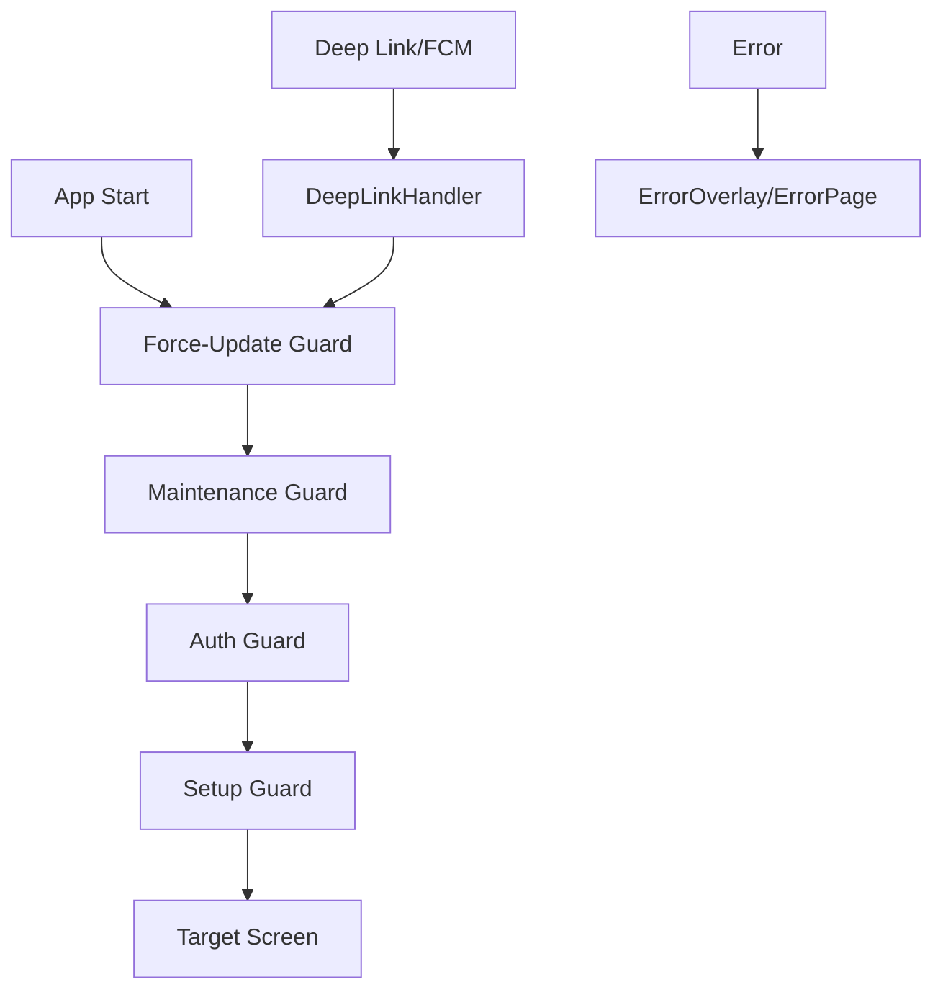

# ADR-0006: Core Routing Architecture

## ステータス

承認済み

## コンテキスト

PassPalアプリは複数の画面とフロー（ログイン、セットアップ、メイン機能、設定）を持ち、以下の要件を満たすルーティングシステムが必要です：

### 要件

1. **4段階ガードシステム**: Force-Update → Maintenance → Auth → Setup の順序で評価
2. **Deep Link対応**: URI、FCM、ウィジェットタップからの統一ナビゲーション
3. **既存Core連携**: auth、error、networkとのシームレス統合
4. **型安全ルーティング**: Freezedによるルートパラメータ
5. **分析・ログ**: GA4へのナビゲーション情報送信

### 現在の課題

- ルーティングシステムが未実装
- 認証状態とUI状態の不整合
- Deep Linkハンドリングの欠如
- メンテナンス・強制アップデート時の画面遷移が未定義

## 決定

### アーキテクチャ概要

単一GoRouterインスタンスを中心とした宣言的ルーティングを採用し、既存のcore/auth、core/error、core/networkと連携します。



### コンポーネント設計

#### 1. ルート定義

```dart
enum AppRoute {
  // 認証フロー
  loginStudentId('/login/student-id'),
  loginGoogle('/login/google'),
  loginCuId('/login/cu-id'),
  
  // セットアップフロー
  setupCampus('/setup/campus'),
  setupNotification('/setup/notification'),
  setupStart('/setup/start'),
  
  // メインフロー（ShellRoute）
  mainHome('/main/home'),
  mainTimetable('/main/timetable'),
  mainBus('/main/bus'),
  mainAssignments('/main/assignments'),
  
  // 詳細画面
  courseDetail('/main/timetable/:courseId/detail'),
  courseMaterials('/main/timetable/:courseId/materials'),
  
  // 特殊画面
  settings('/settings'),
  maintenance('/maintenance'),
  forceUpdate('/force-update'),
  error('/error');
}
```

#### 2. ガードシステム

**評価順序**: Force-Update → Maintenance → Auth → Setup（厳守）

```dart
String? redirect(BuildContext context, GoRouterState state) {
  final ref = ProviderScope.containerOf(context);
  
  // 1. Force-Update チェック
  final remoteConfig = ref.read(remoteConfigProvider);
  if (remoteConfig.requiresForceUpdate && 
      state.subloc != '/force-update') {
    return '/force-update';
  }
  
  // 2. Maintenance チェック
  final isMaintenanceMode = ref.read(maintenanceFlagProvider);
  if (isMaintenanceMode && state.subloc != '/maintenance') {
    return '/maintenance';
  }
  
  // 3. Auth チェック
  final authState = ref.read(authStateProvider);
  if (!authState.isAuthenticated && 
      !state.subloc.startsWith('/login')) {
    return '/login/student-id';
  }
  
  // 4. Setup チェック
  final setupCompleted = ref.read(setupCompletedProvider);
  if (authState.isAuthenticated && 
      !setupCompleted && 
      !state.subloc.startsWith('/setup')) {
    return '/setup/campus';
  }
  
  return null;
}
```

#### 3. Deep Link処理

```dart
class DeepLinkHandler {
  Future<void> handle(Uri uri, {Object? pushPayload}) async {
    try {
      final routeData = _parseRouteData(uri, pushPayload);
      await _goRouter.go(uri.path, extra: routeData);
    } on RouteParsingException catch (e) {
      await _goRouter.go('/error', extra: ErrorPageData(exception: e));
    }
  }
}
```

#### 4. 例外ルーティング統合

| 例外タイプ                | ガード | 遷移先              | UI表現       |
| ------------------------- | ------ | ------------------- | ------------ |
| `ForceUpdateException`    | ✓      | `/force-update`     | 全画面       |
| `MaintenanceException`    | ✓      | `/maintenance`      | 全画面       |
| `AuthenticationException` | ✓      | `/login/student-id` | 全画面       |
| `RouteParsingException`   | -      | `/error`            | 全画面       |
| `UnknownException`        | -      | `ErrorOverlay`      | オーバーレイ |

### Riverpod統合

```dart
// core/routing/providers.dart
final goRouterProvider = Provider<GoRouter>((ref) {
  return GoRouter(
    routes: _routes,
    redirect: (context, state) => _redirect(context, state),
    errorBuilder: (context, state) => ErrorPage(state: state),
    observers: [ref.read(navigationObserverProvider)],
  );
});

final deepLinkHandlerProvider = Provider<DeepLinkHandler>((ref) {
  return DeepLinkHandler(ref.read(goRouterProvider));
});
```

## 実装詳細

### ファイル構成

```text
lib/core/routing/
 ├─ providers.dart           # Riverpod Provider定義
 ├─ app_router.dart          # GoRouter設定
 ├─ routes.dart              # AppRoute enum & path定義
 ├─ models/
 │   ├─ route_data.dart      # Freezed ルートパラメータ
 │   └─ navigation_args.dart # 画面引数モデル
 ├─ guards/
 │   ├─ force_update_guard.dart
 │   ├─ maintenance_guard.dart
 │   ├─ auth_guard.dart
 │   └─ setup_guard.dart
 ├─ deep_link_handler.dart
 ├─ observers/
 │   └─ navigation_observer.dart # GA4統合
 ├─ pages/
 │   ├─ maintenance_page.dart
 │   ├─ force_update_page.dart
 │   └─ error_page.dart
 └─ extensions/
     └─ router_extensions.dart # WidgetRef拡張
```

### Feature層での使用例

#### 1. 基本ナビゲーション

```dart
// features/assignments/presentation/assignment_list_page.dart
class AssignmentListPage extends ConsumerWidget {
  @override
  Widget build(BuildContext context, WidgetRef ref) {
    return Scaffold(
      body: ListView.builder(
        itemBuilder: (context, index) {
          return ListTile(
            onTap: () => ref.pushAssignmentDetail(
              courseId: assignments[index].courseId,
              assignmentId: assignments[index].id,
            ),
          );
        },
      ),
    );
  }
}

// features/assignments/presentation/extensions/navigation.dart
extension AssignmentNavigation on WidgetRef {
  Future<void> pushAssignmentDetail({
    required String courseId,
    required String assignmentId,
  }) async {
    return read(goRouterProvider).pushNamed(
      AppRoute.assignmentDetail.name,
      extra: AssignmentDetailArgs(
        courseId: courseId,
        assignmentId: assignmentId,
      ),
    );
  }
}
```

#### 2. Deep Link処理

```dart
// features/notifications/application/fcm_handler.dart
class FCMHandler {
  FCMHandler(this._ref);
  
  final Ref _ref;
  
  Future<void> handleBackgroundMessage(RemoteMessage message) async {
    final deepLink = message.data['deeplink'];
    if (deepLink != null) {
      final handler = _ref.read(deepLinkHandlerProvider);
      await handler.handle(Uri.parse(deepLink), pushPayload: message.data);
    }
  }
}
```

#### 3. エラーハンドリング

```dart
// features/assignments/application/assignment_notifier.dart
class AssignmentNotifier extends AsyncNotifier<List<Assignment>> {
  @override
  Future<List<Assignment>> build() async {
    try {
      return await _repository.fetchAssignments();
    } on MaintenanceException {
      // MaintenanceGuardが自動的に/maintenanceへリダイレクト
      rethrow;
    } on AuthenticationException {
      // AuthGuardが自動的に/loginへリダイレクト  
      rethrow;
    } on NetworkFailure catch (e) {
      // ErrorOverlayで表示（ナビゲーションは発生しない）
      ref.read(errorNotifierProvider.notifier).show(e);
      rethrow;
    }
  }
}
```

### 既存Core連携

#### core/auth連携

```dart
// guards/auth_guard.dart
bool _isAuthRequired(String location) {
  return !location.startsWith('/login') && 
         !location.startsWith('/maintenance') &&
         !location.startsWith('/force-update');
}

String? evaluateAuthGuard(AuthState authState, String location) {
  if (_isAuthRequired(location) && !authState.isAuthenticated) {
    return '/login/student-id';
  }
  return null;
}
```

#### core/error連携

```dart
// app_router.dart errorBuilder
Widget errorBuilder(BuildContext context, GoRouterState state) {
  final error = state.error;
  if (error is RouteParsingException) {
    return ErrorPage(
      title: 'ページが見つかりません',
      message: error.message,
      canRetry: false,
    );
  }
  return ErrorPage(
    title: '予期しないエラーが発生しました',
    message: error?.toString() ?? 'Unknown error',
    canRetry: true,
  );
}
```

#### core/network連携

```dart
// guards/maintenance_guard.dart
String? evaluateMaintenanceGuard(bool isMaintenanceMode, String location) {
  if (isMaintenanceMode && location != '/maintenance') {
    return '/maintenance';
  }
  return null;
}

// MaintenanceInterceptor（既存）がMaintenanceExceptionをスロー
// → GuardがキャッチしてRedirect実行
```

## 利点

1. **統一性**: 全ナビゲーションが単一ルーターを経由
2. **型安全性**: Freezedモデルによる静的型チェック
3. **テスタビリティ**: MockGoRouterによる完全なテスト可能性
4. **保守性**: ガード順序とリダイレクトロジックの明確化
5. **Analytics**: 全画面遷移の自動トラッキング

## トレードオフ

1. **複雑性**: 複数ガードの相互作用理解が必要
2. **パフォーマンス**: 各ナビゲーションでガード評価実行
3. **デバッグ**: リダイレクトチェーンの追跡困難

## テスト戦略

### 1. Unit Tests

```dart
group('Auth Guard', () {
  test('未認証時は /login/student-id にリダイレクト', () {
    final guard = AuthGuard();
    final result = guard.evaluate(
      AuthStateUnauthenticated(), 
      '/main/home'
    );
    expect(result, '/login/student-id');
  });
});
```

### 2. Widget Tests

```dart
testWidgets('DeepLink処理で正しい画面に遷移', (tester) async {
  final container = ProviderContainer(
    overrides: [
      goRouterProvider.overrideWithValue(mockRouter),
    ],
  );
  
  final handler = container.read(deepLinkHandlerProvider);
  await handler.handle(Uri.parse('/main/timetable/MATH101/detail'));
  
  verify(mockRouter.go('/main/timetable/MATH101/detail')).called(1);
});
```

### 3. Integration Tests

```dart
group('認証フロー統合テスト', () {
  testWidgets('ログアウト時に自動的にログイン画面に遷移', (tester) async {
    // 認証済み状態でアプリ起動
    await tester.pumpWidget(createApp(authState: AuthStateAuthenticated()));
    
    // ログアウト実行
    await tester.tap(find.text('ログアウト'));
    await tester.pumpAndSettle();
    
    // ログイン画面に自動遷移することを確認
    expect(find.byType(LoginPage), findsOneWidget);
  });
});
```

### 4. 例外伝播シナリオテスト

```dart
group('例外伝播シナリオ', () {
  testWidgets('RouteParsingException が Crashlytics に到達', (tester) async {
    final mockCrashlytics = MockCrashlyticsReporter();
    
    final container = ProviderContainer(
      overrides: [
        crashlyticsReporterProvider.overrideWithValue(mockCrashlytics),
      ],
    );
    
    final handler = container.read(deepLinkHandlerProvider);
    
    // 不正なURIでRouteParsingExceptionを発生
    await handler.handle(Uri.parse('/invalid/route/format'));
    
    // Crashlyticsに例外が報告されることを確認
    verify(mockCrashlytics.recordError(
      any<RouteParsingException>(),
      any<StackTrace>(),
      isFatal: false,
    )).called(1);
  });
});
```

## 残課題

1. iOS/Android URL Scheme設定（OS側）
2. Feature層での具体的な画面実装
3. Widget Deep Link設定（native実装）
4. GA4 Dashboard設定

この設計により、PassPalアプリの全ナビゲーション要件を満たし、既存のcoreアーキテクチャとシームレスに連携できます。
