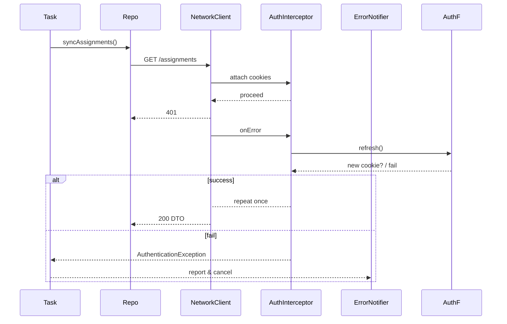

# ADR-0007: Core Background Architecture

## ステータス

採用済み

## 背景

PassPalアプリケーションでは、ユーザーアクション無しで常に最新データを提供するため、バックグラウンドタスクシステムが必要です。以下の課題を解決する必要があります：

- **プラットフォーム制約**: Android 14 Doze mode、iOS 17 BGTaskScheduler最小間隔
- **セッション維持**: core/authとの連携、AuthInterceptorとの統合
- **エラー・リトライ戦略**: 指数バックオフ + ジッター
- **DI統合**: Riverpodによるタスク一意性制御

### 要件

1. **タスク登録API**: `BackgroundTaskScheduler.scheduleOneShot/Periodic/registerUnique/cancel`
2. **プラットフォーム抽象化**: AndroidScheduler (WorkManager)、IosScheduler (BGTaskScheduler)
3. **Push ⇄ Task ブリッジ**: FCMデータメッセージ (`"task":…`) の即座実行
4. **リトライポリシー**: 1分→2→5→15…、±30%ジッター
5. **Crashlytics統合**: 成功/失敗と実行時間を非致命的ログとして報告

## 決定事項

### アーキテクチャ概要

Interceptorチェーンパターンを採用し、以下の責務を分離：

```text
Repository → core/network (Connectivity → Auth → Retry…) → TaskDispatcher → RetryPolicy → Crashlytics
```

ネットワーク層のリトライが最初に実行され、その後タスク層が全体の再実行を制御します。

### 1. コンポーネント設計

```text
lib/core/background/
 ├─ models/
 │   ├─ background_task.dart          # タスク定義
 │   ├─ task_constraints.dart         # 実行制約
 │   ├─ task_result.dart              # 実行結果
 │   └─ task_frequency.dart           # 実行頻度
 ├─ platform/
 │   ├─ background_scheduler.dart     # 抽象インターフェース
 │   ├─ android_scheduler.dart        # WorkManager実装
 │   └─ ios_scheduler.dart            # BGTaskScheduler実装
 ├─ retry/
 │   ├─ retry_policy.dart             # 指数バックオフ + ジッター
 │   └─ retry_config.dart             # 設定管理
 ├─ dispatcher/
 │   ├─ task_dispatcher.dart          # JSON引数パース、ハンドラー呼び出し
 │   ├─ task_handler.dart             # ハンドラー抽象化
 │   └─ task_timeout.dart             # タイムアウト管理
 ├─ push/
 │   ├─ push_to_task_bridge.dart      # FCMデータメッセージ処理
 │   ├─ fcm_task_parser.dart          # "task": {...} 解析
 │   └─ immediate_executor.dart       # 即座実行
 ├─ monitoring/
 │   ├─ crashlytics_reporter.dart     # 成功/失敗/期間レポート
 │   └─ task_breadcrumbs.dart         # パンくずリスト
 ├─ debug/
 │   ├─ debug_console.dart            # DeveloperMenu統合
 │   └─ manual_executor.dart          # runTaskNow()
 ├─ providers/
 │   ├─ background_scheduler_provider.dart
 │   ├─ task_handler_provider.dart    # family pattern
 │   └─ retry_policy_provider.dart
 └─ errors/
     └─ background_task_exception.dart
```

### 2. プラットフォーム仕様

#### Android 14 / WorkManager 準拠

- `PeriodicWorkRequest`の**15分最小間隔**を遵守
- より短いトリガーには高優先度FCMを使用
- `ExpeditedWorkRequest`は**通知タップ**または**即座ウィジェット更新**のみで使用
- `setRequiredNetworkType(NOT_ROAMING)`でDoze制限を回避

#### iOS 17 / BGTaskScheduler

- OSが**15分〜6時間**の実行ウィンドウを決定、フォールバックは6時間に設定
- `requiresNetworkConnectivity = true`でアプリ再起動後のタスク復元を保証

### 3. 拡張リトライポリシー

- 指数バックオフ + ジッターでスパイク負荷を防止
- `AuthenticationException`または`MaintenanceException`で**即座にギブアップ**
- AuthInterceptorが1回リトライ、失敗時は**タスク失敗・キャンセル**

### 4. Riverpod + Isolate統合

- タスク実行時、`ProviderContainer(overrides: [...])`で依存関係を分離isolateに安全に注入
- `taskHandlerProvider` (family)で**feature → core依存関係逆転**を保証、テストで`FakeScheduler`置換を可能にする

### 5. 既存Core依存関係

| コンポーネント | core/error | core/network | core/auth | core/storage |
|----------------|------------|--------------|-----------|--------------|
| **RetryPolicy** | ✅ 例外分類 | - | - | ✅ 設定永続化 |
| **TaskDispatcher** | ✅ 例外報告 | - | - | - |
| **PushToTaskBridge** | ✅ 例外処理 | ✅ Repository呼び出し | ✅ セッション復旧 | - |
| **AndroidScheduler** | ✅ Crashlytics | - | - | - |
| **IosScheduler** | ✅ Crashlytics | - | - | - |

## 使用例

### Feature層での利用

```dart
// features/assignments/application/sync_assignments_notifier.dart
final syncAssignmentsTask = BackgroundTask(
  id: 'assignments.sync',
  periodic: const Duration(hours: 6), // フォールバックウィンドウ
  initialDelay: const Duration(minutes: 15),
  constraints: const TaskConstraints(networkRequired: true),
  handler: (ctx) async {
    final repo = ctx.read(assignmentsRepositoryProvider);
    await repo.syncAssignments(); // TTLロジック & SWR使用
  },
);

await ref
  .read(backgroundSchedulerProvider)
  .registerUnique(syncAssignmentsTask);
```

Repository側では、ローカルストレージのTTL（課題リストは1時間）をチェックし、古い場合のみフェッチしてDBにupsertします。

### エラーハンドリング・リトライフロー



- 成功時 → `Result.success()`
- 失敗時 → `RetryPolicy`が次回実行をスケジュール
- `MaintenanceException`はUI層と同じルーティングガードロジックで処理

## テスト戦略

| テストタイプ | カバレッジ |
|-------------|-----------|
| **Unit** | `RetryPolicy`計算、AndroidSchedulerの重複タグ防止 |
| **Widget** | 通知タップ → DeepLink → 即座タスク実行 → UI更新 |
| **Integration** | WorkManager TestDriver: 401→自動再ログイン→成功・失敗ケース |
| **Golden** | メンテナンス画面ルーティング + ガードの回帰テスト |

## Crashlytics & Remote Config

- 各タスクの`start`/`finish`をパンくずリストとしてログ、ANRタグ付けで高速デバッグ支援
- Remote Configフラグを問題のあるパーサーやフローの動的キルスイッチとして使用

## 影響

- **Positive**: 統一されたバックグラウンドタスクAPI、プラットフォーム制約の透明な処理
- **Negative**: 新しい依存関係（workmanager、background_fetch）、初期実装複雑度
- **Risks**: プラットフォーム制約の変更、OS制限の進化

## 関連リソース

- [ADR-0001: Core Error Handling Architecture](./0001-core-error-handling-architecture.md)
- [ADR-0004: Network Layer Architecture](./0004-network-layer-architecture.md)
- [ADR-0005: Core Auth Architecture](./0005-core-auth-architecture.md)
