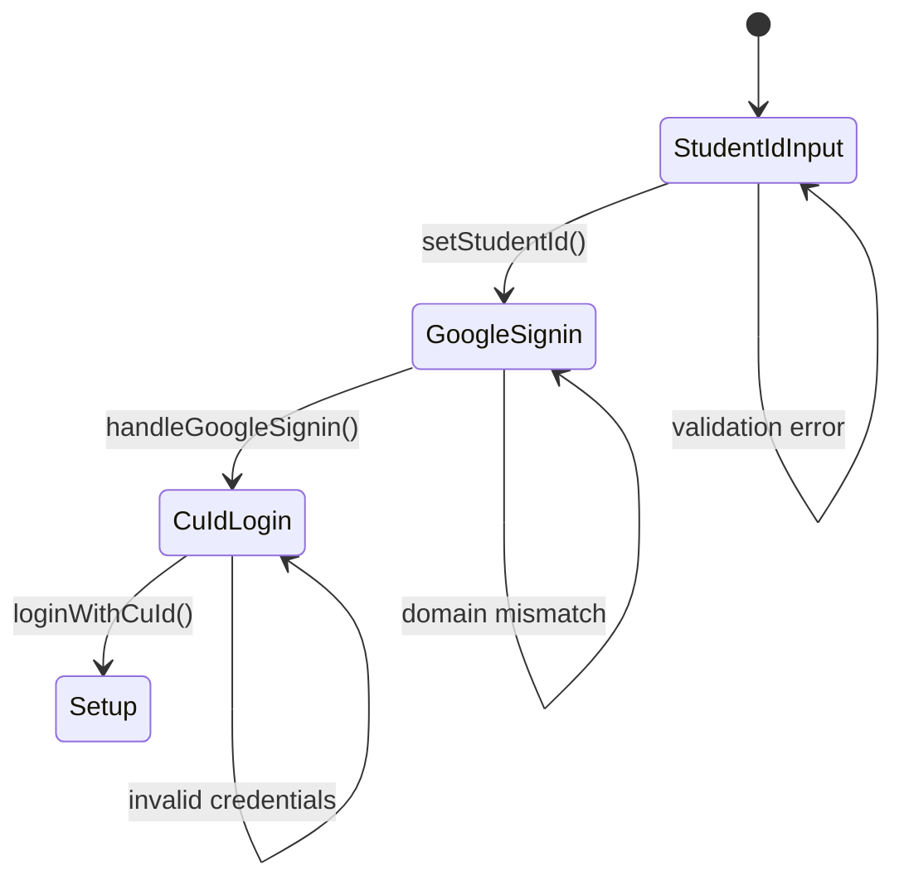

# ADR-0010: Login機能アーキテクチャ

## ステータス

承認済み

## 決定日

2025-06-28

## コンテキスト

PassPalのユーザー認証フローは3段階のプロセスを経る必要があります：

1. 学生ID入力・検証
2. Google SSO認証（中京大学ドメイン）
3. CU-IDパスワード認証

この複雑なフローを管理し、Clean Architectureの原則に従いながら、ユーザビリティとセキュリティを両立させる必要があります。

### 要件

1. **3段階認証フロー**: Student ID → Google SSO → CU-ID
2. **リアルタイムバリデーション**: 学生ID形式（正規表現）
3. **ドメイン検証**: Google認証は `@m.chukyo-u.ac.jp` のみ許可
4. **状態管理**: Riverpod 2.0+による型安全な状態管理
5. **エラーハンドリング**: 段階別の適切なエラー表示
6. **ナビゲーション**: GoRouterによる宣言的ルーティング
7. **Clean Architecture**: domain → application → presentation

## 決定

### アーキテクチャ

```text
lib/features/login/
 ├─ domain/                           # ドメインロジック
 │   ├─ student_id.dart              # 学生ID値オブジェクト  
 │   └─ login_exceptions.dart        # ドメイン例外
 ├─ application/                     # アプリケーション層
 │   ├─ login_form_state.dart        # Freezed状態クラス
 │   ├─ login_form_notifier.dart     # Riverpod状態管理
 │   └─ validators.dart              # バリデーション関数
 └─ presentation/                    # プレゼンテーション層
     ├─ pages/                       # ページコンポーネント
     │   ├─ student_id_page.dart
     │   ├─ google_signin_page.dart
     │   └─ cu_id_page.dart
     └─ widgets/                     # 共通ウィジェット
         ├─ primary_button.dart
         ├─ error_banner.dart
         └─ password_field.dart
```

### 主要コンポーネント

#### 1. ドメイン層

##### StudentId値オブジェクト

```dart
class StudentId {
  static final _regex = RegExp(r'^[a-zA-Z]\d{6}$');
  
  StudentId(String raw) {
    if (!_regex.hasMatch(raw.trim())) {
      throw ArgumentError('Student ID must match pattern [a-zA-Z]\\d{6}');
    }
    value = raw.toLowerCase();
  }
  
  String get expectedEmail => '$value@m.chukyo-u.ac.jp';
}
```

##### ドメイン例外

- `InvalidStudentIdException`: 学生ID形式エラー
- `AccountLinkException`: Googleアカウントドメインミスマッチ
- `InvalidLoginStepException`: フロー順序違反

#### 2. アプリケーション層

##### LoginFormState（Freezed）

```dart
@freezed
class LoginFormState with _$LoginFormState {
  const factory LoginFormState({
    StudentId? studentId,
    @Default(false) bool isLoading,
    String? errorMessage,
    @Default(LoginStep.studentId) LoginStep currentStep,
    @Default(false) bool isGoogleSignedIn,
  }) = _LoginFormState;
}
```

##### LoginFormNotifier（Riverpod AsyncNotifier）

- `setStudentId()`: 学生ID設定とGoogle認証への遷移
- `handleGoogleSignin()`: Google認証処理とドメイン検証
- `loginWithCuId()`: 最終認証とセットアップへの遷移

#### 3. プレゼンテーション層

##### StudentIdPage

- リアルタイム正規表現バリデーション
- 無効時の"Next"ボタン無効化
- エラー表示とクリア機能

##### GoogleSigninPage

- 期待されるメールアドレスの表示
- Google認証トリガー
- ドメインミスマッチ時のエラー表示

##### CuIdPage

- パスワード入力フィールド（表示/非表示切り替え）
- 認証エラーの適切な表示
- 成功時のsetup画面への遷移

### 状態フロー



### エラーハンドリング戦略

| エラータイプ | 表示方法 | ユーザーアクション |
|-------------|----------|------------------|
| 学生ID形式エラー | フィールドエラー | 修正して再入力 |
| Googleドメインミスマッチ | エラーバナー | 正しいアカウントで再認証 |
| CU-ID認証失敗 | フィールドエラー | パスワード再入力 |
| ネットワークエラー | グローバルオーバーレイ | リトライ |

### 依存関係

#### Core依存（features指針に準拠）

- `authFacadeProvider`: 認証API
- `authStateProvider`: 認証状態監視
- `credentialStorageProvider`: 認証情報保存
- `goRouterProvider`: ルーティング
- `errorNotifierProvider`: グローバルエラー

#### 制約

- 他feature依存禁止
- Flutter依存はpresentation層のみ
- 全例外はAppExceptionサブクラス

## 実装例

### 使用方法

```dart
// Provider使用
final loginState = ref.watch(loginFormNotifierProvider);

// 学生ID設定
await ref.read(loginFormNotifierProvider.notifier)
  .setStudentId('A123456');

// Google認証
await ref.read(loginFormNotifierProvider.notifier)
  .handleGoogleSignin();

// 最終ログイン
await ref.read(loginFormNotifierProvider.notifier)
  .loginWithCuId('password');
```

### バリデーション

```dart
// 学生ID検証
final error = LoginValidators.validateStudentId('A123456');
if (error != null) {
  // エラー表示
}

// Googleアカウント検証
final isValid = LoginValidators.isValidStudentEmail(
  'a123456@m.chukyo-u.ac.jp',
  'a123456'
);
```

## 正の結果

1. **型安全性**: Freezed+Riverpodによる型安全な状態管理
2. **テスタビリティ**: レイヤー分離による単体テスト容易性
3. **再利用性**: 共通ウィジェットの他画面での活用
4. **保守性**: Clean Architectureによる関心の分離
5. **ユーザビリティ**: リアルタイムバリデーションと適切なエラー表示
6. **セキュリティ**: ドメイン検証と段階的認証

## 負の結果

1. **複雑性**: 3層アーキテクチャによるコード量増加
2. **学習コスト**: Freezed、Riverpod、Clean Architectureの理解要求
3. **初期開発速度**: 厳密なレイヤー分離による実装時間増加

## 代替案

### 案1: シンプルなStatefulWidget

#### メリット

- 実装が簡単
- 学習コストが低い

#### デメリット

- 状態管理が複雑になる
- テストが困難
- 再利用性が低い

### 案2: Provider + ChangeNotifier

#### 長所

- Flutter標準に近い
- 比較的シンプル

#### 短所

- 型安全性に欠ける
- 不変性が保証されない
- Riverpodとの一貫性がない

## 参照

- [ADR-0005: Core Auth Architecture](0005-core-auth-architecture.md)
- [ADR-0006: Core Routing Architecture](0006-core-routing-architecture.md)
- [Features指針](../../.github/instructions/features.instructions.md)
- [Login指針](../../.github/instructions/login.instructions.md)
