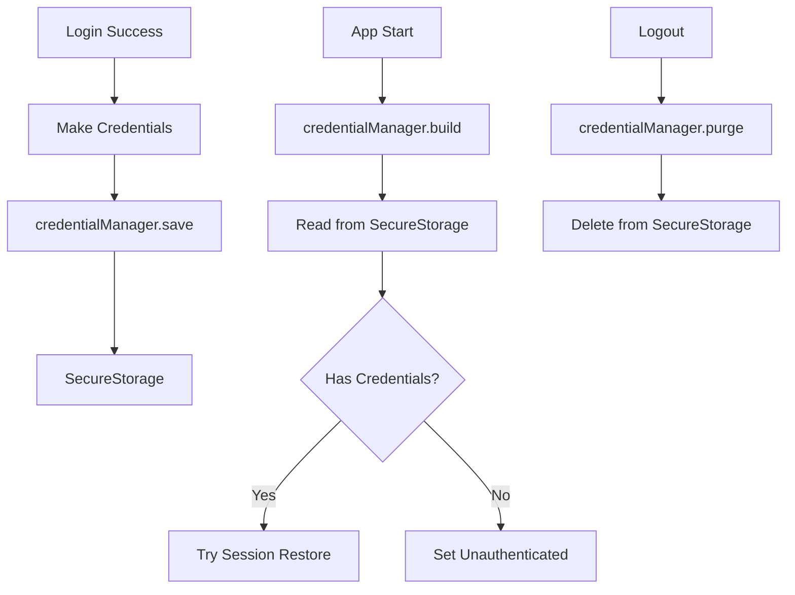
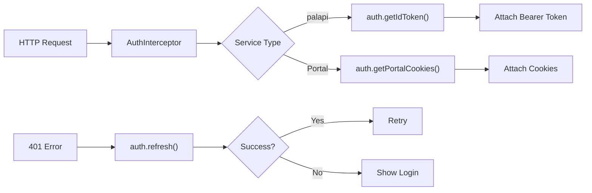
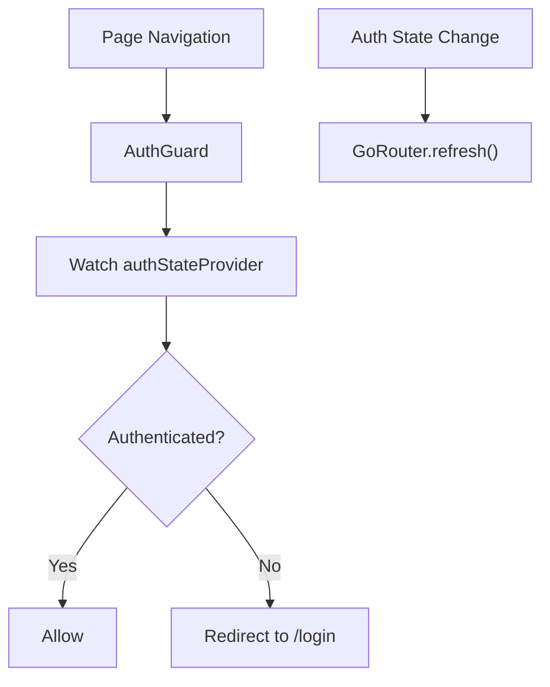
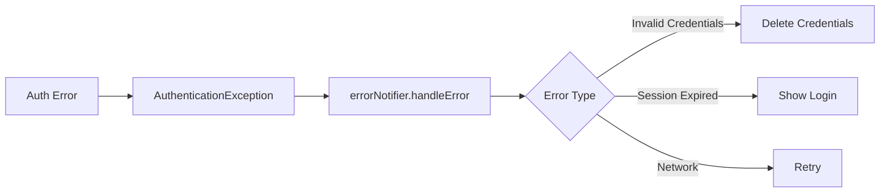

# Auth Implementation Plan

## Purpose

* **Unified Auth Foundation** — Manage portal login session cookies and palapi Firebase ID Tokens centrally; provide transparent auth for all cores.
* **Reactive State Management** — Use Riverpod StateNotifier to stream `Unauthenticated → Authenticating → Authenticated → Error` states, referenced by UI/background/routing.
* **Automatic Session Management** — Watch Cookie/Token expiry and auto-refresh before expiration; handle failures gracefully.
* **Secure Implementation** — Store credentials via SecureStorage (core/storage); minimize secrets in memory.

---

## Domain Knowledge

### Auth Method Matrix

| Service            | Method         | Token/Cookie         | Expiry | Refresh Method      | Linked Core      |
| ------------------ | -------------- | -------------------- | ------ | ------------------- | ---------------- |
| palapi             | Firebase Auth  | ID Token (JWT)       | 1 hour | Auto refresh token  | network          |
| ALBO/MaNaBo/Cubics | Shibboleth SSO | Session Cookies (2x) | 1 hour | Re-login with ID/PW | network, storage |
| Google Account     | OAuth 2.0      | Linked via Firebase  | -      | Google Sign-In      | -                |

### Shibboleth Auth Flow

1. **Initial Login** — POST ID/PW → SAML → IdP issues cookies
2. **Cookie Validation** — Send cookies with requests; expired returns HTML login form (200 OK)
3. **Auto Refresh** — Retry login with saved ID/PW 5 minutes before expiry (once only)

### Firebase Auth Integration

* Google Sign-In → Firebase Auth → Custom claims
* `@m.chukyo-u.ac.jp` domain check
* Firebase SDK manages auto ID token refresh

---

## Responsibilities & Scope

### In Scope

1. **Auth Flows** — Google Sign-In, Shibboleth SSO, unified processing
2. **Token/Cookie Management** — CRUD of tokens/cookies
3. **Auth State Management** — Define and transition AuthState, provide via Riverpod
4. **Auto-Refresh** — Monitor and preemptively refresh before expiry
5. **Session Validation** — Detect expired session from response parsing

### Out of Scope

* UI (login screens) (presentation layer)
* HTTP networking (`core/network`)
* Error UI (`core/error`)
* Routing (`core/routing`)
* Remote config (`core/config`)
* Persistent storage (`core/storage`)

---

## Architecture

### 1. Auth State Models

**AuthState**

* Sealed class (freezed): `Unauthenticated`, `Authenticating`, `Authenticated` (holds User, AuthSession), `AuthError` (holds AppError, last userId)
* Helpers: `isAuthenticated`, `isLoading`

**AuthSession**

* Holds: studentId, Firebase ID token, portal cookies, issuedAt, TTL, optional refreshToken
* Methods: `expiresAt`, `isExpired`, `shouldRefresh`

**User**

* Holds: id, studentId, displayName
* Factory from Firebase user

### 2. AuthNotifier Implementation

* Extend Riverpod `AsyncNotifier`, stream `AuthState`
* Inject GoogleSignInService, ShibbolethAuthenticator, CredentialManager
* Manage auto-refresh Timer, cleanup in dispose

**State Monitoring & Session Restore**

* Watch `authStateChanges()` from Firebase Auth
* If user is null, set Unauthenticated
* If exists, try restoring session
* On success, push Authenticated, schedule auto-refresh

**Google Auth Flow**

1. Run Google Sign-In
2. Validate domain (@m.chukyo-u.ac.jp)
3. Link with Firebase Auth
4. On success, new state via `authStateChanges`

**Student ID Auth Flow**

1. Validate studentId/password
2. Shibboleth login → cookies
3. Save credentials to SecureStorage
4. Firebase custom token auth
5. Build AuthSession, push Authenticated, schedule auto-refresh

**Token/Session Refresh**

* Check state; skip if not authenticated
* Load saved credentials, error if missing
* Shibboleth re-login and Firebase ID token refresh
* Update state and persist new cookies
* On failure, logout and push session expired error

**Logout**

* Cancel auto-refresh timer
* Firebase and Google sign-out
* Clear stored credentials and cookies
* Push Unauthenticated

**Helpers**

* `_scheduleRefresh`: auto-refresh 5 min before expiry
* `getIdToken`: get (and refresh if needed) current ID token
* `getPortalCookies`: get current portal cookies

### 3. Auth Service Implementations

**GoogleSignInService**

* Wrapper for GoogleSignIn library
* Restrict to Chukyo domain
* Provides sign-in, Firebase link, sign-out
* Handles platform exceptions

**ShibbolethAuthenticator**

* Uses NetworkClient, HtmlParser for auth
* 3 steps: fetch login page, parse form, post login
* Check 302 (success) vs 200 (failure)
* Verify cookies exist
* Cookie clear method resets NetworkClient CookieJar

### 4. Credential Management

**CredentialManager**

* Uses SecureStorage for encrypted save of studentId/password/cookie
* Implements Riverpod `AsyncNotifier` to auto-load credentials
* Cookie data as JSON for serialization
* Methods: save, updateCookie, purge
* On error, reports StorageException to ErrorNotifier

**Credentials Model**

* Holds: studentId, password, optional cookie
* Immutable (freezed), supports JSON

### 5. Exceptions

**AuthenticationException (sealed)**

* Factory methods:

  * `invalidCredentials`
  * `sessionExpired`
  * `credentialsNotFound`
  * etc.

**AccountLinkException**

* For domain mismatch during Google sign-in
* Holds offending email

---

## Core Integration Flows

### 1. Storage Core



### 2. Network Core



### 3. Routing Core



### 4. Background Core

```mermaid
flowchart TD
A[BG Task] --> B[Isolate]
B --> C[ProviderContainer]
C --> D[Check authProvider]
D --> E{Authenticated?}
E -->|Yes| F[Run Task]
E -->|No| G[Try auth.refresh()]
G --> H{Success?}
H -->|Yes| I[Run Task]
H -->|No| J[Give Up]
```

### 5. Error Core



---

## Security Considerations

### 1. Memory Protection

**SecureMemory**

* `clearSensitiveData`: zero-fill Uint8List data
* `obfuscateForLogging`: show only first 2 chars + \*\*\*\* for logs

### 2. Token Scope

* Firebase custom claims: `studentId`, `role`, `campus`, `exp`

### 3. Session Fixation

* Issue new session ID after login
* Set `Secure`, `HttpOnly`, `SameSite` for cookies

---

## Testability

### Mock Implementation

**MockAuthNotifier**

* Returns fixed test state for tests
* Login: 500ms delay; test123/password = success, others = `invalidCredentials` error

### Integration Test Scenario

1. Start app unauthenticated
2. Confirm login screen shown
3. Input test credentials
4. Tap login
5. Confirm navigation to home

---

## Metrics

### Key Indicators

* Login success rate (by method)
* Session refresh success rate
* Auth error rate (by type)
* Token acquisition latency
* Auto-refresh timing accuracy

### Firebase Analytics

**AuthAnalytics extension**

* Send auth events with method, success, error\_code, duration\_ms to Firebase Analytics
