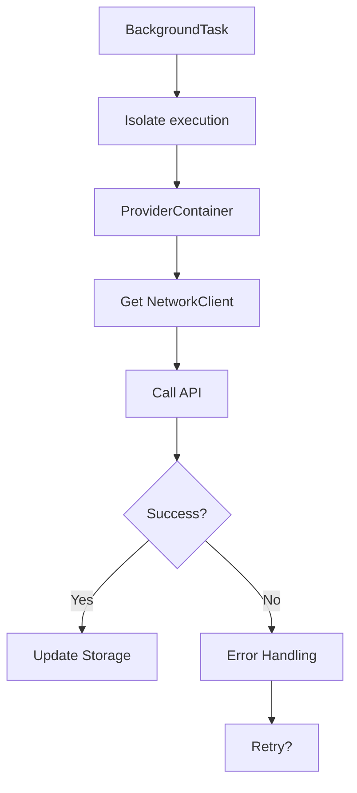
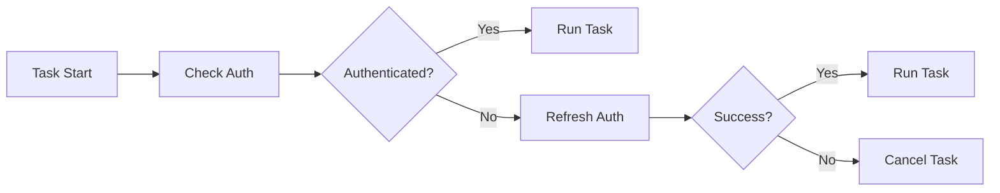
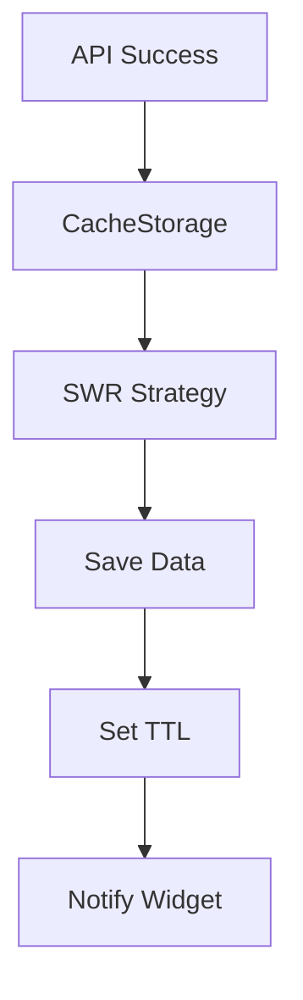
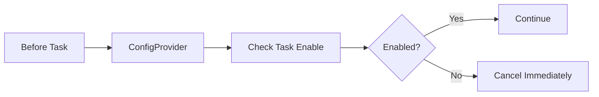
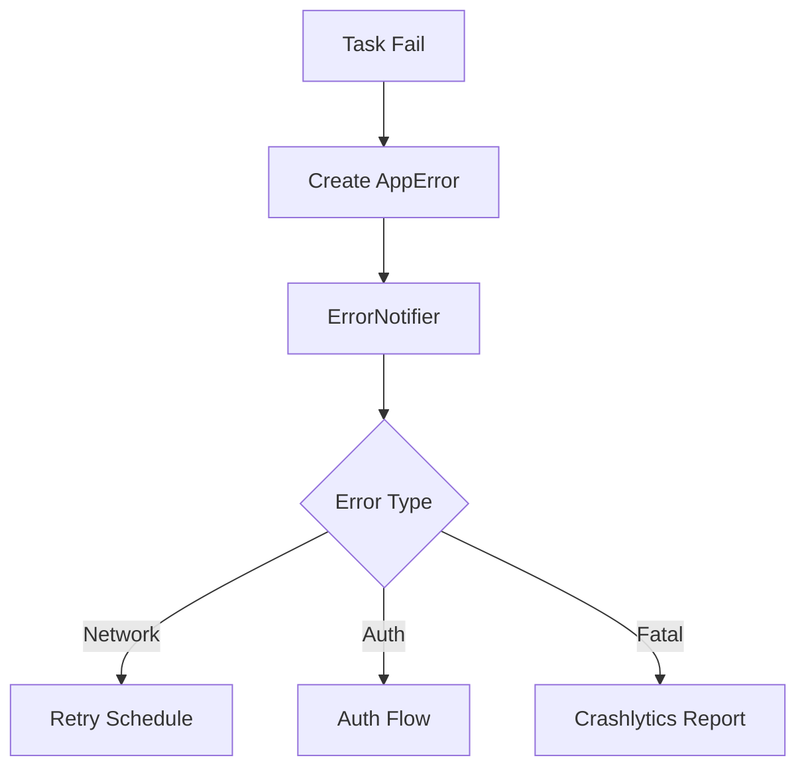
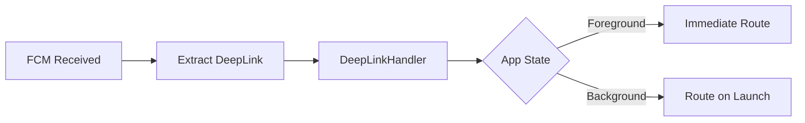

# Background Implementation Plan

## Purpose

* **Unified Background Execution Framework** — Abstract Android WorkManager and iOS BGTaskScheduler, allowing background tasks without platform-specific concerns
* **Smart Sync Control** — Efficiently sync timetable, assignments, and cancellation info within OS limits, collaborating with push notifications for real-time updates
* **Reliable Retry Mechanism** — Ensure auto-recovery on failure with exponential backoff + jitter, maintaining data consistency even during network outages
* **Resource-Efficient Execution** — Minimize battery and network usage, ensuring timely data updates when needed by the user

---

## Domain Knowledge

### Task Types & Execution Frequency

| Task Type              | Trigger                      | Min Interval | Network | Priority | Core Dependencies       |
| ---------------------- | ---------------------------- | ------------ | ------- | -------- | ----------------------- |
| **Timetable Sync**     | Every 6h + on widget request | 15 min       | Yes     | High     | network, storage, auth  |
| **Cancellation Fetch** | Push + every 1h              | 15 min       | Yes     | Highest  | network, storage, notif |
| **Assignment Update**  | Push + BGTask                | 15 min       | Yes     | High     | network, storage, auth  |
| **Bus Timetable**      | Every 3 days                 | 24h          | Yes     | Low      | network, storage        |
| **Notice Fetch**       | Push + every 1h              | 15 min       | Yes     | Medium   | network, storage        |
| **Attendance Sync**    | On user action only          | -            | Yes     | High     | network, auth           |

### Platform Constraints

| OS         | Runtime         | Min Interval | Time Limit | Network Limitations       | Notes                                   |
| ---------- | --------------- | ------------ | ---------- | ------------------------- | --------------------------------------- |
| Android 14 | WorkManager     | 15 min       | 10 min     | Limited during Doze       | ExpeditedWork quota-restricted          |
| iOS 17     | BGTaskScheduler | 15m–6h (OS)  | 30 sec     | Limited in Low Power Mode | Scheduling interval varies by app usage |

---

## Responsibilities & Scope

### Included

1. **Task Abstraction** — Define `BackgroundTask` base class & implementations
2. **Scheduler Integration** — Unified API for WorkManager/BGTaskScheduler
3. **FCM Integration** — Start tasks instantly on push and handle data
4. **Retry Control** — Auto-retry with exponential backoff + jitter
5. **Isolate Management** — Run tasks off main thread in isolates
6. **Execution Monitoring** — Track task start, finish, failure; send metrics
7. **Remote Control** — Dynamically enable/disable tasks via Remote Config

### Not Included

* Notification UI (handled by presentation layer)
* API communications (`core/network`)
* Data persistence (`core/storage`)
* Authentication (`core/auth`)
* Error screen display (`core/error`)

---

## Architecture

### 1. Task Definition

In `models/background_task.dart`, define a sealed `BackgroundTask` class using Freezed. Each task has types:

* **SyncTimetableTask**: For timetable sync. Holds widget flag & student ID
* **FetchCancellationsTask**: For fetching cancellation info
* **UpdateAssignmentsTask**: Updates assignments for a list of course IDs
* **RefreshBusScheduleTask**: Updates bus timetable by campus
* **FetchNotificationsTask**: Fetches notices after a given date
* **ProcessDeepLinkTask**: Handles deep links with URL & metadata

Each task also includes metadata: ID (task type name), priority (urgent/high/medium/low), timeout (5 min), and network requirements.

In `models/task_result.dart`, define a Freezed class for task results:

* **TaskSuccess**: On success. Includes task ID, exec time, result data
* **TaskFailure**: On failure. Includes error info, retry count, next retry
* **TaskCancelled**: On cancel. Includes reason

### 2. Task Scheduler Implementation

In `scheduler/background_scheduler.dart`, define a cross-platform interface for:

* One-shot/periodic execution
* Canceling tasks
* Retrieving pending tasks

In `scheduler/platform/android_scheduler.dart`, implement Android WorkManager:

* Store task info as JSON in inputData
* Set constraints (network, battery, charging, etc)
* Run urgent tasks as ExpeditedWork
* Enforce 15 min minimum interval for periodic
* Exponential backoff policy (start: 30 sec)

In `scheduler/platform/ios_scheduler.dart`, implement iOS BGTaskScheduler:

* Use BGProcessingTaskRequest or BGAppRefreshTaskRequest
* Set network/external power requirements
* Delete oldest if too many pending tasks
* Actual periodic interval is OS-controlled (15 min–6h)

### 3. Task Execution Engine

In `engine/task_executor.dart`, implement a Riverpod-based engine:

Execution flow:

1. Check if task enabled by Remote Config
2. Check network requirements
3. Run task in an isolate
4. Notify results via Stream, send metrics
5. On failure, schedule retry with exponential backoff

For Isolate execution:

* Spawn separate isolate per task
* Build new ProviderContainer in the isolate
* End isolate immediately after task
* Propagate errors to main thread

Retry logic:

* Do not retry on auth or maintenance errors
* Max 5 attempts
* 30s × 2^(attempt-1) + 0–10s jitter

### 4. FCM Integration

In `services/fcm_task_bridge.dart`, integrate Firebase Cloud Messaging:

* Handle messages in both foreground & background
* Generate tasks from `task_type` field in message
* Handle deep links if present
* Run background handlers in an independent ProviderContainer

### 5. Widget Integration

In `services/widget_task_service.dart`, integrate with home screen widgets:

* Communicate with native via MethodChannel
* For updateTimetable, run as ExpeditedWork instantly
* For getTimetableData, return cached data instantly
* After update, notify widget refresh per platform

---

## Core Collaboration Flows

### 1. Network Core (API communication)

### 2. Auth Core (Authentication)

### 3. Storage Core (Data update)

### 4. Config Core (Remote control)

### 5. Error Core (Error handling)

### 6. Routing Core (Deep link)

---

## Error Handling

### Background Exception Hierarchy

Define BackgroundException as a sealed class extending AppException:

* **IsolateCrashedException**: Isolate crashed
* **TaskTimeoutException**: Task timeout
* **QuotaExceededException**: Quota exceeded
* **PlatformNotSupportedException**: Unsupported feature/platform

Consider the following retryable: NetworkFailure, StorageException, TaskTimeoutException, session-expired AuthenticationException.

---

## Testability

### Mock Implementation

`MockBackgroundScheduler` provides:

* Records of scheduled tasks
* History of executions
* Immediate execution in test mode
* Mock runs with 100ms delay

### Isolate Testing

Test isolate-based execution using IsolateRunner. Override mock repositories for API-free testing.

---

## Metrics Monitoring

### Key Metrics

* Task success rate (by type)
* Avg execution time (p50/p95/p99)
* Retry & recovery rate
* Isolate crash rate
* Battery usage impact

### Firebase Performance

Create traces for each task execution; log type, priority, result, duration as metrics.

### Crashlytics Integration

On task failure, record error info, task data, attempt count, platform. Set current background task ID as custom key.
