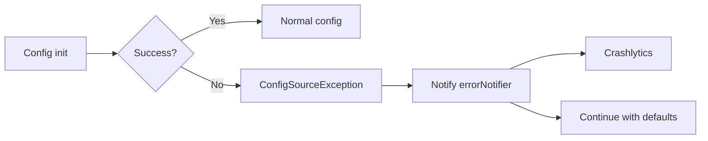
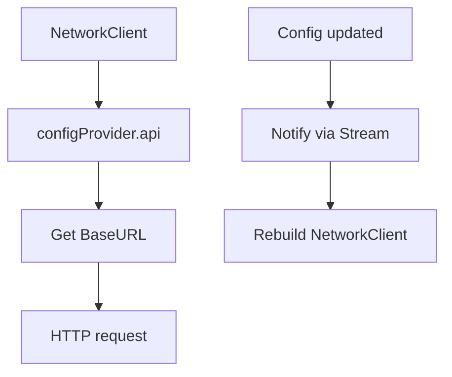
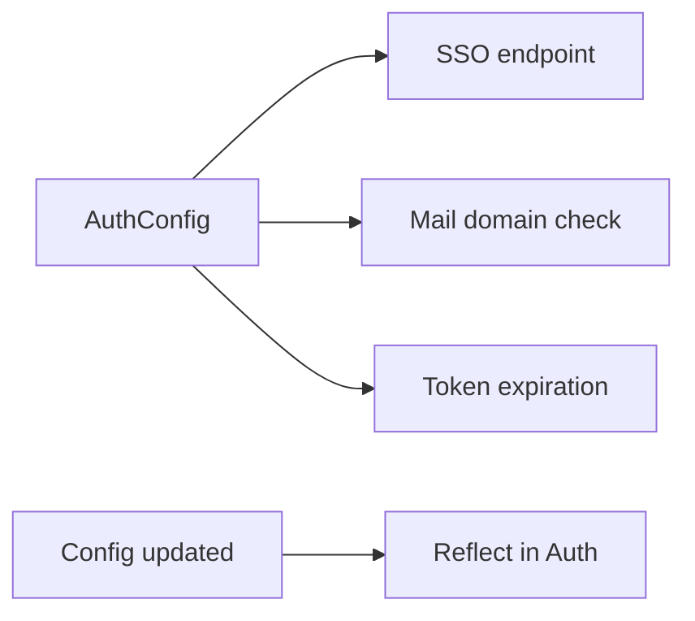
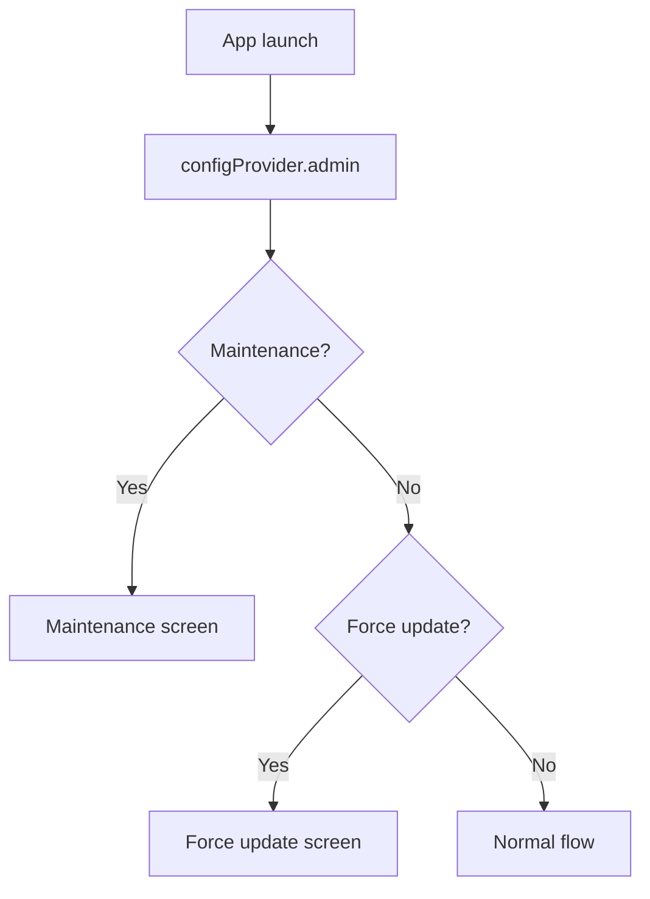

# Config Implementation Plan

## Overview

* **Purpose** ― Provide a **unified configuration facade** for the application, integrating settings from **multiple sources** (.env file, Firebase Remote Config), and offering feature flags, API endpoints, debug/admin settings with **type safety** and **reactivity**.
* **Features** ― Priority-based merge (.env > Remote Config > default), real-time update observation, 15-minute in-memory cache for fast access, guaranteed fallback on error.
* **Assumptions** ― Remote Config is **cached in memory for 15 min**. Fetch interval min. 1 min. .env is dev-only; in production, Remote Config is the primary dynamic source.

---

## Domain Knowledge

| Item                       | Detail                                                                                       | Core Dependency    |
| -------------------------- | -------------------------------------------------------------------------------------------- | ------------------ |
| **Priority Order**         | .env file > Remote Config > hardcoded default                                                | -                  |
| **Firebase Remote Config** | Min fetch interval: 1 min; fetch timeout: 10s; in-memory cache: 15 min                       | background (retry) |
| **Reactive Update**        | Listen to Remote Config’s `onConfigUpdated`, propagate to dependent components automatically | all cores          |
| **Type Safety**            | Immutable models with Freezed, JSON serialization, compile-time checks                       | -                  |
| **Error Recovery**         | On fetch failure, use previous cache or default values, prioritize service continuity        | error              |

---

## Scope and Responsibility

### Included

1. **Multi-source integration** ― Merge .env and Remote Config by priority, expose as unified `AppConfig`.
2. **Feature flag management** ― Real-time on/off control of dev/experimental features; provide stream for individual flag.
3. **API configuration** ― Dynamic, environment-based base URLs for palapi, ALBO, MaNaBo, Cubics, SSO.
4. **Admin controls** ― Apply minimum required version, maintenance mode, and emergency stop flags from Remote Config instantly.
5. **Type-safe access** ― Expose config values via Riverpod Provider, with type safety, async initialization, and error handling.
6. **Reactive monitoring** ― Observe config changes as `Stream<AppConfig>`, propagate to all dependent cores instantly.
7. **Memory cache** ― Fast-access 15 min cache with invalidation strategy.

### Not Included

* Config value persistence (handled by *core/storage*)
* UI updates based on config (handled by presentation layer)
* Network setup (handled by *core/network*)
* Actual HTTP requests (handled by *core/network*)

---

## Config Categories and Structure

| Category         | Model          | Responsibility                                                  | Core Dependency |
| ---------------- | -------------- | --------------------------------------------------------------- | --------------- |
| **ApiConfig**    | API endpoints  | Base URLs for palapi, ALBO, MaNaBo, Cubics, SSO                 | network         |
| **FeatureFlags** | Feature flags  | Gradual rollout, A/B testing, emergency disable                 | all features    |
| **DebugConfig**  | Debug settings | Log level, dev tools, test env flags                            | error           |
| **AdminConfig**  | Admin settings | Min required version, maintenance notice, forced update         | routing, error  |
| **AuthConfig**   | Auth settings  | SSO endpoint, token expiration, biometrics, allowed mail domain | auth            |

---

## Error Handling

| Exception Type                  | Condition               | Handling                                | Layer               | Fallback             |
| ------------------------------- | ----------------------- | --------------------------------------- | ------------------- | -------------------- |
| **ConfigSourceException**       | Remote Config init fail | Notify error core, use .env/default     | error (Crashlytics) | .env > default       |
| **ConfigParseException**        | Parse failure           | Use default for that field, log warning | error               | Field default        |
| **ConfigNotFoundException**     | Required config missing | Throw as `AppException`, halt startup   | error, presentation | None (fatal)         |
| **ConfigFetchTimeoutException** | Network timeout         | Use cache, retry in background          | background          | Previous cache value |

---

## Architecture

### 1. Config Model Definition

AppConfig class (with Freezed):

* Contains ApiConfig, FeatureFlags, DebugConfig, AdminConfig, AuthConfig categories
* Records lastFetchedAt
* Supports fromJson (for JSON conversion)
* Provides defaults factory (per category)

### 2. ConfigProvider Implementation

As an async Riverpod provider, responsibilities:

* **Initialization flow**: Init with defaults → merge .env (dev) → fetch/merge Remote Config → set cache timer → start real-time update monitoring
* **Cache**: Refresh cache every 15 min via Timer
* **Update monitoring**: Listen to FirebaseRemoteConfig onConfigUpdated, update cache on changes
* **Error handling**: On init failure, notify errorNotifierProvider, continue with defaults
* **Resource mgmt**: Clean up timer/stream controller onDispose

### 3. Interfaces for Other Cores

Define extension methods per category:

* **ApiConfigExtensions**: `getBaseUrl()` by API service type
* **DebugConfigExtensions**: Parse log level to enum, decide Crashlytics condition
* **AdminConfigExtensions**: Compare current/min version, check for forced update

---

## Inter-Core Coordination Flow

### 1. Error Core



### 2. Network Core



### 3. Auth Core



### 4. Routing Core



---

## Example Config Values

```json
{
  "api": {
    "palapi_base_url": "https://api.chukyo-passpal.app/v1",
    "albo_base_url": "https://cubics-pt-out.mng.chukyo-u.ac.jp",
    "manabo_base_url": "https://manabo.cnc.chukyo-u.ac.jp",
    "cubics_base_url": "https://cubics-as-out.mng.chukyo-u.ac.jp",
    "sso_base_url": "https://shib.chukyo-u.ac.jp"
  },
  "features": {
    "enable_widget": true,
    "enable_notifications": true,
    "enable_dev_menu": false,
    "enable_analytics": true
  },
  "debug": {
    "log_level": "info",
    "force_crashlytics": false,
    "mock_network": false
  },
  "admin": {
    "maintenance_mode": false,
    "maintenance_message": "",
    "minimum_version": "1.0.0",
    "update_url_ios": "https://apps.apple.com/...",
    "update_url_android": "https://play.google.com/..."
  },
  "auth": {
    "allowed_mail_domain": "m.chukyo-u.ac.jp",
    "session_timeout_minutes": 60,
    "enable_biometric": true
  }
}
```

---

## Testability

### Mock Strategy

In tests, mock ConfigProvider by:

* **testConfigProvider**: Provide fixed test values (e.g., localhost URLs)
* **Simulate config changes**: Override provider with TestConfig, use methods like updateAdmin for dynamic changes
* **Stream verification**: Validate config propagation via configStreamProvider

### Remote Config Mock

Implement MockRemoteConfig:

* `setMockValue` allows arbitrary key/value setting
* `onConfigUpdated` stream simulates update events
* MockRemoteConfigValue returns values for various data types

---

## Config Value Validation

Implement ConfigValidation extension for:

* **URL validation**: Ensure API base URLs are valid URLs
* **Version format**: Check minimumVersion is semantic version
* **Domain format**: Validate allowedMailDomain contains dot and is valid
* If errors exist, return list of error messages
