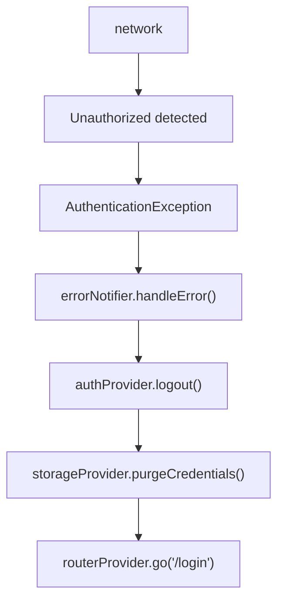

# Error Implementation Plan

## Purpose

* **Unified Error Model**: Define a single error hierarchy for all layers, enabling type-safe exception handling.
* **Centralized Error Management**: Apply shared recovery policies across UI, background, and network layers to eliminate code duplication.
* **Observability**: Integrate non-fatal error tracking with Crashlytics.
* **Automatic Recovery**: Implement error-specific recovery strategies to enhance UX.

---

## Domain Knowledge

### Error Types & Handling Matrix

| Error Type                  | Source              | Auto-Recover                   | UI Display          | BG Task Action    | Related Core    |
| --------------------------- | ------------------- | ------------------------------ | ------------------- | ----------------- | --------------- |
| **AuthenticationException** | 401/Auth Failure    | Delete creds → Re-login screen | Error dialog        | Immediate Give-Up | auth, storage   |
| **MaintenanceException**    | 503/Maintenance     | None (show maintenance screen) | Maintenance screen  | Immediate Give-Up | routing, config |
| **NetworkFailure**          | Connection error    | Auto-retry (exp. backoff)      | Snackbar w/ Retry   | RetryPolicy       | network         |
| **ParseFailure**            | Parse error         | None (show error)              | Error notice        | Immediate Give-Up | —               |
| **UpdateRequiredException** | Old app version     | None (redirect to store)       | Force update screen | Immediate Give-Up | routing, config |
| **StorageException**        | Local storage error | Clear cache → Retry            | Toast               | Retry             | storage         |

### Remote Config

* Config core manages Remote Config values.
* Error core references via `ConfigProvider`.
* 15-minute cache managed by config core.

---

## Responsibilities & Scope

### In-Scope

1. **Error Model Definition**: Hierarchy of `Failure` (recoverable) and `Exception` (system error).
2. **Global Error Handlers**: Use `runZonedGuarded` and `PlatformDispatcher.onError` to collect uncaught exceptions.
3. **ErrorNotifier**: Riverpod-based error state and UI notification.
4. **Error Mapping Logic**: Map all exceptions to the unified error model.
5. **Crashlytics Integration**: Send non-fatal errors with custom attributes.
6. **Logging Facade**: Control log output by environment (debug/release).

### Out of Scope

* HTTP-to-error mapping (handled by `core/network` ErrorInterceptor)
* Auth state management (`core/auth`)
* Error screen implementation (presentation layer)
* Remote Config fetching (`core/config`)

---

## Architecture

### Error Hierarchy

Define base class `AppError` with:

* message (required)
* errorCode (optional)
* stackTrace (optional)
* timestamp (required)
* isRecoverable flag (abstract)
* retryDelay (optional)

Two sealed classes inherit from `AppError`:

* `Failure`: recoverable (isRecoverable=true)
* `AppException`: system error (isRecoverable=false)

### ErrorNotifier

Riverpod-based error notification system:

* State: `AsyncValue<void>`
* `handleError` method updates state & sends to Crashlytics
* For recoverable errors, attempt auto-recovery
* Implement recovery logic per error type (e.g., re-login for auth errors, retry scheduling for network errors)

---

## Logging

### Unified Log Output

`AppLogger` class:

* Debug: color-coded console output
* Release: send Warning+ to Crashlytics
* Dev menu: also write Info+ to file if enabled
* Accepts log level, message, extras, error object

### Crashlytics Custom Attributes

When sending errors, include:

* Exception type
* Error code
* Timestamp (ISO8601)
* For NetworkFailure: network error type
* For ParseFailure: parser version
* Always as non-fatal (`fatal: false`)

---

## Integration Flows

### 1. Auth Integration (Auth Error)



### 2. Background Task Integration

```mermaid
flowchart TD
    A[backgroundTask] --> B[Error]
    B --> C[errorNotifier (BG isolate)]
    C --> D[Check RetryPolicy]
    D --> E{Retry?}
    E -- yes --> F[Exp. backoff]
    E -- no  --> G[Give-Up]
```

---

## Testability

* Provide testable ErrorNotifier provider
* Allow test doubles (MockErrorNotifier)
* Dependency injection via ProviderContainer override
* Simulate error scenarios (e.g., auto-recovery on auth error)
* Verify expected behaviors (e.g., auth state transitions)

---

## Settings

### Retry Config by Error

| Error Type       | Initial Delay | Max Retries | Backoff Factor |
| ---------------- | ------------- | ----------- | -------------- |
| NetworkFailure   | 1s            | 5           | 2.0            |
| StorageException | 2s            | 3           | 2.0            |

### Log Level Thresholds

* Debug: All
* Release: Warning+ to Crashlytics
* File: Info+ (when Dev menu enabled)
