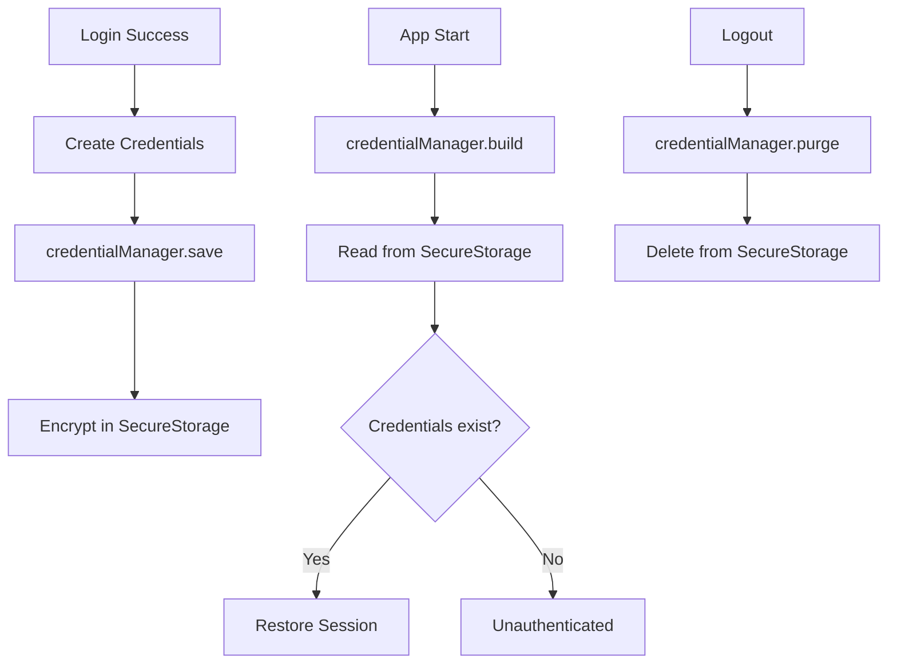
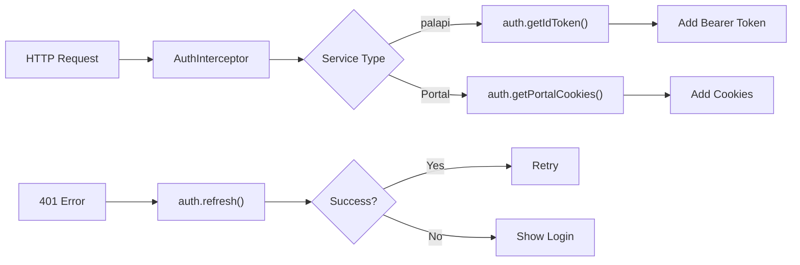
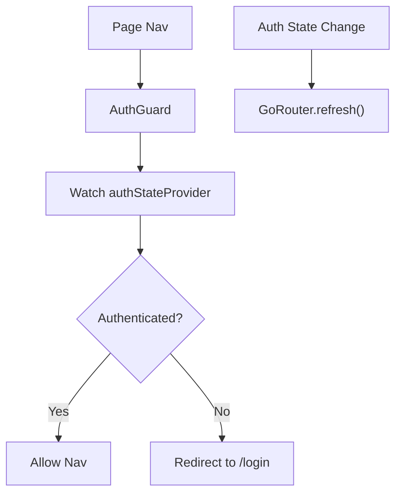
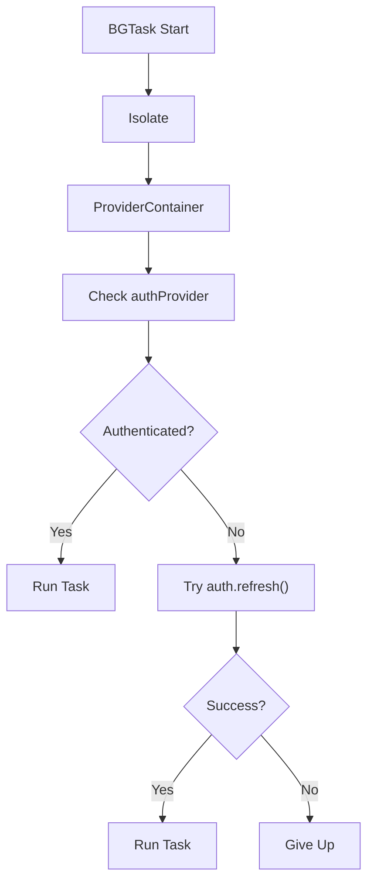
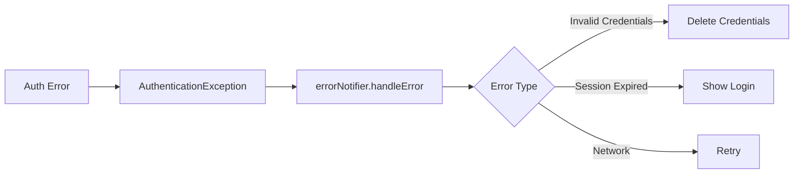

# Network Implementation Plan

## Objectives

* **Unified Authentication Platform** — Centrally manage portal login session cookies and palapi Firebase ID tokens, providing transparent authentication to all cores.
* **Reactive State Management** — Use Riverpod StateNotifier to stream `Unauthenticated → Authenticating → Authenticated → Error`, allowing UI, background, and routing to reference the same authentication state.
* **Automatic Session Management** — Monitor cookie/token expiry, attempt preemptive renewal, and handle errors/fallbacks on failure.
* **Secure Implementation** — Store credentials encrypted via SecureStorage, minimize in-memory exposure.

---

## Domain Knowledge

### Authentication Matrix

| Service                | Method         | Token/Cookie         | TTL    | Refresh             | Linked Core      |
| ---------------------- | -------------- | -------------------- | ------ | ------------------- | ---------------- |
| **palapi**             | Firebase Auth  | ID Token (JWT)       | 1 hour | Auto refresh token  | network          |
| **ALBO/MaNaBo/Cubics** | Shibboleth SSO | Session Cookies (x2) | 1 hour | Re-login with ID/PW | network, storage |
| **Google Org Account** | OAuth 2.0      | Linked to Firebase   | -      | Google Sign-In      | -                |

### Shibboleth Auth Flow

1. **First Login**: POST ID/PW → SAML Response → IdP issues cookies
2. **Cookie Validation**: Cookies sent on requests; on expiry, returns login form (200 OK)
3. **Auto-Refresh**: Try re-login 5 min before expiry using stored ID/PW (once only)

### Firebase Auth Integration

* Google Sign-In → Firebase Auth → Set custom claims
* Verify `@m.chukyo-u.ac.jp` domain
* ID Token auto-refresh (managed by Firebase SDK)

---

## Responsibilities & Scope

### Included

1. **Auth Flows** — Google Sign-In, Shibboleth SSO, unified authentication
2. **Token/Cookie Management** — Centralized get/save/refresh/delete
3. **Auth State Management** — AuthState definition & transitions, Riverpod streaming
4. **Auto-Renewal** — Expiry monitoring & preemptive refresh
5. **Session Validation** — Detect expired sessions via response parsing

### Excluded

* UI (login screen, etc)
* HTTP comms (handled by `core/network`)
* Error screens (`core/error`)
* Routing control (`core/routing`)
* Remote Config (`core/config`)
* Credential persistence (`core/storage`)

---

## Architecture

### 1. Auth State Model

**AuthState**

* Sealed class via freezed, with 4 states:

  * `Unauthenticated`
  * `Authenticating`
  * `Authenticated` (holds User, AuthSession)
  * `AuthError` (holds AppError, last userId)
* Utility: `isAuthenticated`, `isLoading`

**AuthSession**

* Holds student ID, Firebase ID token, portal cookies
* Issued/expiry times, optional refresh token
* Methods: `expiresAt`, `isExpired`, `shouldRefresh`

**User**

* Holds ID, email, student ID, display name, profile image (optional), emailVerified, createdAt
* Factory from Firebase user

### 2. AuthNotifier

**Basics**

* Extends Riverpod `AsyncNotifier`, streams `AuthState`
* Injects GoogleSignInService, ShibbolethAuthenticator, CredentialManager
* Manages auto-refresh timer, cleans up on dispose

**State Monitoring & Session Restore**

* Watches Firebase Auth `authStateChanges()`
* If user null → Unauthenticated; else, tries session restore
* On success, emits Authenticated and schedules auto-refresh

**Google Auth Flow**

1. Run Google Sign-In
2. Verify @m.chukyo-u.ac.jp domain
3. Link with Firebase Auth
4. On success, new state is streamed automatically

**Student Number Auth Flow**

1. Validate entered ID/PW
2. Run Shibboleth auth to get cookies
3. Save credentials via SecureStorage
4. Authenticate with Firebase custom token
5. Build AuthSession, stream Authenticated, schedule auto-refresh

**Token/Session Refresh**

* Only if current state is authenticated
* Loads saved credentials; throw if missing
* Run Shibboleth re-auth & Firebase ID token refresh
* Update state & persist cookies
* On failure, logout and emit session expired error

**Logout**

* Cancel auto-refresh timer
* Run Firebase and Google sign-out
* Clear saved credentials/cookies
* Stream Unauthenticated

**Helpers**

* `_scheduleRefresh`: Schedule auto-refresh 5 min before expiry
* `getIdToken`: Fetch current ID token (refresh if needed)
* `getPortalCookies`: Fetch current portal cookies

### 3. Auth Services

**GoogleSignInService**

* Wraps GoogleSignIn library
* Restricts to chukyo-u domain
* Provides sign-in, Firebase linkage, sign-out
* Handles platform exceptions

**ShibbolethAuthenticator**

* Uses NetworkClient, HtmlParser
* Three steps: get login page, extract form data, POST auth
* Judges by response code: 302 (success), 200 (fail)
* Checks required cookies (JSESSIONID, shib\_idp\_session)
* Has method to clear cookies in NetworkClient

### 4. Credential Management

**CredentialManager**

* Encrypts student ID, PW, cookies with SecureStorage
* AsyncNotifier for auto-load on app launch
* Cookies serialized as JSON
* Three ops: save, update cookies, purge
* Notifies ErrorNotifier with StorageException on error

**Credentials Model**

* Holds student ID, PW, optional cookies
* Immutable via freezed, supports JSON conversion

### 5. Exceptions

**AuthenticationException**

* Sealed Failure class
* Factory methods:

  * `invalidCredentials`
  * `sessionExpired`
  * `credentialsNotFound`
  * etc.

**AccountLinkException**

* For Google domain errors
* Holds offending email

---

## Cross-Core Integration Flows

### 1. Storage Core (Credential Management)

### 2. Network Core (Auth Header Injection)

### 3. Routing Core (Auth Guard)

### 4. Background Core (Background Auth)

### 5. Error Core (Error Handling)

---

## Security

### 1. Memory Protection

**SecureMemory**

* `clearSensitiveData`: Zero-fill sensitive Uint8List
* `obfuscateForLogging`: Log only first 2 chars + \*\*\*\*

### 2. Token Scope Control

Manage in Firebase Custom Claims:

* studentId, role, campus, exp

### 3. Session Fixation Protection

* Issue new session ID on login success
* Set `Secure`, `HttpOnly`, `SameSite` on cookies

---

## Testability

### Mock Implementation

**MockAuthNotifier**

* Returns fixed states for testing
* After 500ms delay, test123/password logs in successfully; else, returns `invalidCredentials`

### Integration Test Scenarios

1. Launch app unauthenticated
2. Verify login screen
3. Enter test credentials
4. Tap login
5. Confirm navigation to home

---

## Performance

### 1. Token Cache

**TokenCache**

* Return cached tokens within 5 min window
* Fetch new if cache missed
* Simple timestamp-based

### 2. Parallel Initialization

Run auth inits in parallel via `Future.wait`:

* Google Sign-In
* Load saved credentials
* Check Remote Config

---

## Metrics

### Key Metrics

* Login success rate (by method)
* Session refresh success rate
* Auth error rate (by type)
* Token fetch latency
* Auto-refresh timing accuracy

### Firebase Analytics

**AuthAnalytics**

* Send auth events to Firebase Analytics
* Log method, success, error\_code, duration\_ms as params
