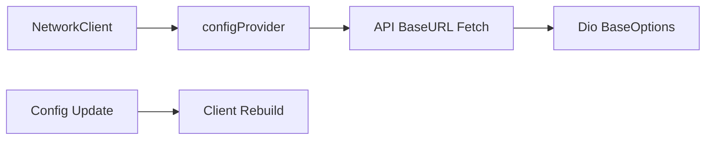
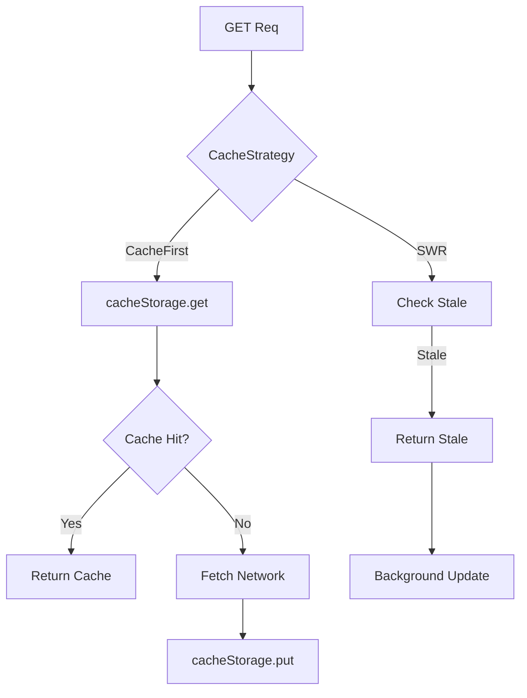
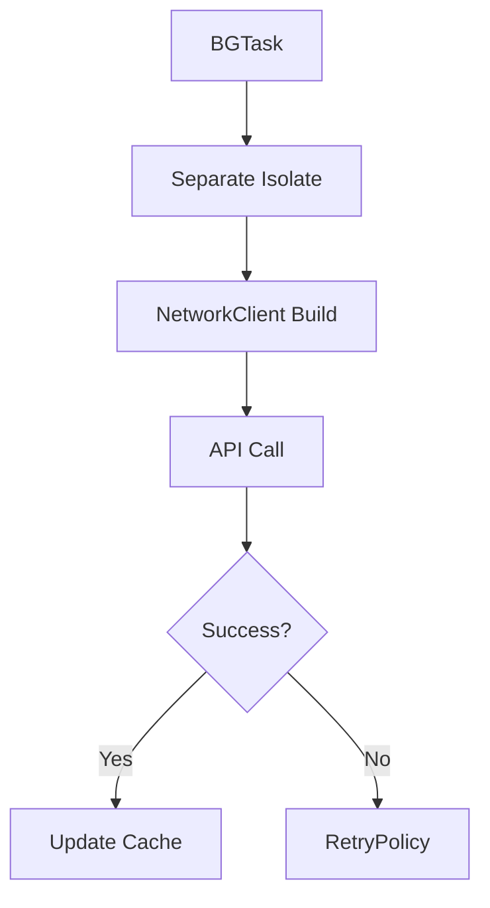

# Network Implementation Plan

## Purpose

* **Unified HTTP Communication Base**: Abstract all HTTP communication to palapi/ALBO/MaNaBo/Cubics/SSO, implementing authentication, error handling, cache, and retry logic transparently.
* **Unified Authentication**: Handle different authentication methods (Firebase ID Token/Cookie) through a common interface, minimizing feature-layer implementation cost.
* **Reliable Networking**: Automatically detect network issues, auth expiration, and maintenance, with proper retry/fallback logic.
* **Offline Support**: Provide best UX regardless of network, prioritizing cache display (SWR strategy).

---

## Domain Knowledge

### API Service Types

| Service   | Auth              | Error Detection     | Core Roles  |
| --------- | ----------------- | ------------------- | ----------- |
| palapi    | Firebase ID Token | HTTP status         | auth, error |
| ALBO      | Shibboleth Cookie | Session timeout msg | auth, error |
| MaNaBo    | Shibboleth Cookie | Login form detect   | auth, error |
| Cubics    | Shibboleth Cookie | Session timeout msg | auth, error |
| SSO       | Form login        | Redirect detection  | auth        |
| PublicAPI | -                 | HTTP status         | -           |

### Network State & Retry Strategy

| State      | Detection          | Handling            | Retry  | Use Cache     |
| ---------- | ------------------ | ------------------- | ------ | ------------- |
| Offline    | connectivity\_plus | Return cache ASAP   | ×      | ○ (stale OK)  |
| Timeout    | Dio timeout        | Exponential backoff | ○ (3x) | ○ (after 1st) |
| 401/403    | HTTP status        | Refresh & retry     | ○ (1x) | ×             |
| 429        | Rate Limit         | Retry-After header  | ○      | ○             |
| 500 errors | HTTP status        | Exponential backoff | ○ (5x) | ○             |
| 503        | HTTP status/HTML   | Fail immediately    | ×      | ×             |

---

## Responsibilities & Scope

### Included

1. **HTTP Client Management**: Dio instance setup, config, interceptors.
2. **Authentication**: AuthInterceptor for auto token/cookie attach and refresh.
3. **Error Handling**: ErrorInterceptor for response parsing and unified error model.
4. **Cache Strategy**: CacheInterceptor for SWR, ETag/Last-Modified.
5. **Retry Logic**: RetryInterceptor for smart retry with jitter.
6. **Network Monitoring**: ConnectivityMonitor for online/offline state tracking.

### Excluded

* HTML parsing (presentation layer)
* Business logic (feature repositories)
* Data models (feature domains)
* UI updates (presentation)
* Background execution (core/background)

---

## Architecture

### 1. NetworkClient Abstraction

`NetworkClient` interface defines standard HTTP methods.

* `get(path, query, options, cacheStrategy)`
* `post(data, query, options)`
* etc.

`CacheStrategy` enum:

* `networkFirst` (default), `cacheFirst`, `networkOnly`, `cacheOnly`.

### 2. Per-service Client Implementations

* **PalapiClient**: Implements NetworkClient, holds Dio + AuthProvider. Sets BaseOptions: `application/json`, 10s connect, 30s receive timeout. Adds Firebase ID Token as Bearer for `get`.
* **PortalClient**: Implements NetworkClient, holds Dio + CookieJar + HtmlParser. `getHtml` uses `ResponseType.plain` for GET, parses as HTML, detects session expiration (throws `AuthenticationException.sessionExpired()`), otherwise parses/returns Document.

### 3. Interceptors

* **AuthInterceptor**: Adds auth info by service type. On 401, triggers refresh + retry.
* **ErrorInterceptor**: Converts DioException to AppError: network failures, auth errors, rate limit, maintenance, server errors. Notifies errorNotifier, rethrows.
* **CacheInterceptor**: Handles cache strategy. Offline always switches to cacheFirst. On `cacheFirst`/`cacheOnly`, returns cache. SWR returns stale cache, then updates in BG. Adds If-None-Match if ETag exists. Saves cache on response.
* **RetryInterceptor**: On retryable errors, retries up to max (w/ exponential backoff + jitter 0-1s).

### 4. Network Monitoring

* **ConnectivityMonitor**: Riverpod provider tracking connectivity status (wifi, cellular, ethernet, offline). `isOnline` getter returns current bool.

### 5. Riverpod Providers

* `dioProvider`: Instantiates Dio per API, sets base URL, timeouts, adds all interceptors (+ Log on debug).
* `palapiClientProvider`: Provides PalapiClient with config/auth injected.
* `alboClientProvider`: Provides PortalClient with specific Dio, persistent CookieJar, HtmlParser.
* `connectivityStatusProvider`: Watches connectivityMonitor state, returns status (defaults to offline if unknown/error).
* `mockConfigProvider`: Generates MockConfig for testing, with delay and scenario.

---

## Integration Flow with Other Cores

### 1. Config Core (Endpoint Resolution)



### 2. Auth Core (Attach Auth Info)

```mermaid
flowchart TD
    A[HTTP Req] --> B{Service Type}
    B -->|palapi| C[Get Firebase ID Token]
    B -->|Portal| D[Auto Attach Cookie]
    C --> E[Set Authorization Header]
    D --> F[CookieJar]
    G[401 Error] --> H[auth.refresh()]
    H --> I{Success?}
    I -->|Yes| J[Retry Req]
    I -->|No| K[Error Notify]
```

### 3. Storage Core (Cache)



### 4. Error Core (Error Conversion)


### 5. Background Core (BG Networking)



---

## Error Handling Strategy

| Error Type   | Detection          | Auto Retry      | Fallback      | Notify      |
| ------------ | ------------------ | --------------- | ------------- | ----------- |
| Offline      | connectivity\_plus | ×               | Show cache    | Snackbar    |
| Timeout      | Dio timeout        | ○ (3x)          | Old cache     | None        |
| Auth Error   | 401/403            | ○ (1x, refresh) | Login screen  | None        |
| Rate Limit   | 429                | ○ (wait)        | Cache         | Toast       |
| Server Error | 500-599            | ○ (5x)          | Error screen  | Crashlytics |
| Maintenance  | 503/HTML detect    | ×               | Maint. screen | None        |

---

## Testability

### Mock Clients

`MockNetworkClient` implements NetworkClient, returns test responses.

* Register mock with `mockResponse(path, data, statusCode)`.
* `get` simulates delay, returns mock if exists; else throws DioException.

### Interceptor Testing

Test `AuthInterceptor` for 401 auto-refresh. Use `MockAuthProvider` and `MockDio`, check that first request triggers 401, refresh is called, retry succeeds, and mock call counts are as expected.

---

## Monitoring Metrics

### Key Metrics

* API response time (p50/p95/p99)
* Error rate (by type)
* Cache hit rate
* Retry success rate
* Network status change frequency

### Firebase Performance

`getWithTrace` extension records Firebase Performance HTTP metrics:

* On request: start trace.
* On response: log status, content type, payload, stop trace.
* On error: log error type as attribute.
