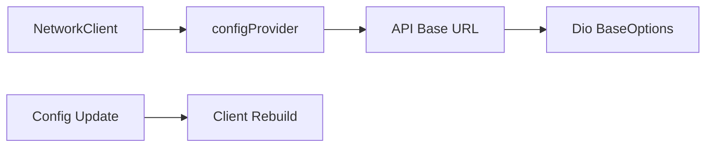
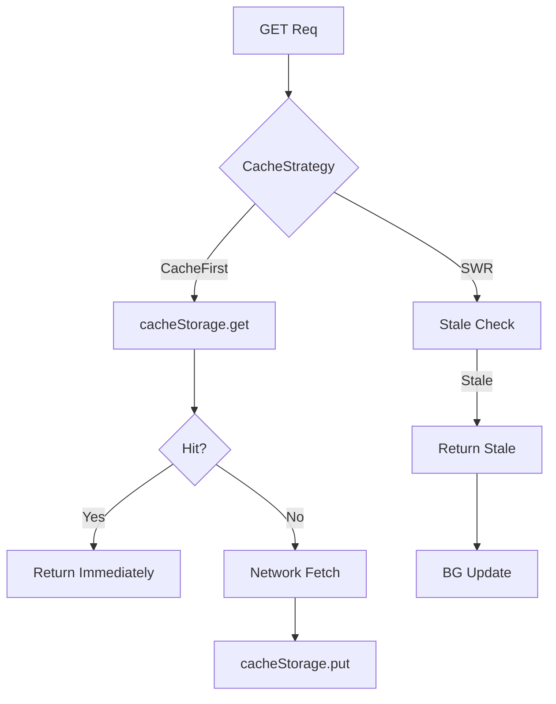
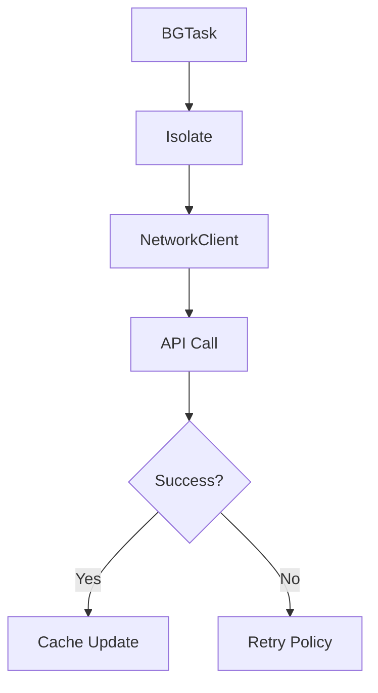

# Network Implementation Plan

## Purpose

* **Unified HTTP Platform** — Abstract all HTTP requests to palapi, ALBO, MaNaBo, Cubics, and SSO, providing transparent authentication, error handling, caching, and retry.
* **Unified Auth** — Handle various authentication (Firebase ID Token, Cookie) with a single interface to minimize feature-layer complexity.
* **Reliable Networking** — Automatically detect network failures, expired authentication, maintenance, and apply proper retry or fallback.
* **Offline Support** — Use SWR strategy to prioritize cached data, ensuring optimal UX even with unstable connectivity.

---

## Domain Knowledge

### API Service Classification

| Service    | Auth              | Error Detection        | Core Modules |
| ---------- | ----------------- | ---------------------- | ------------ |
| palapi     | Firebase ID Token | HTTP Status            | auth, error  |
| ALBO       | Shibboleth Cookie | Session expiry message | auth, error  |
| MaNaBo     | Shibboleth Cookie | Login form detection   | auth, error  |
| Cubics     | Shibboleth Cookie | Session expiry message | auth, error  |
| SSO        | Form Auth         | Redirect detection     | auth         |
| Public API | -                 | HTTP Status            | -            |

### Network & Retry Strategy

| State   | Detection          | Handling                  | Retry    | Cache                |
| ------- | ------------------ | ------------------------- | -------- | -------------------- |
| Offline | connectivity\_plus | Return cache immediately  | No       | Yes (Stale OK)       |
| Timeout | Dio timeout        | Exponential backoff       | Yes (3x) | Yes (after 1st fail) |
| 401/403 | HTTP Status        | Refresh auth, retry       | Yes (1x) | No                   |
| 429     | Rate Limit         | Follow Retry-After header | Yes      | Yes                  |
| 5xx     | Server Error       | Exponential backoff       | Yes (5x) | Yes                  |
| 503     | Maintenance        | Abort immediately         | No       | No                   |

---

## Responsibilities & Scope

### Included

1. **HTTP Client Management** — Dio instance creation/config/interceptor management
2. **Auth Integration** — Auto token/cookie add/update via AuthInterceptor
3. **Error Conversion** — Convert responses to unified error model via ErrorInterceptor
4. **Cache Strategy** — SWR via CacheInterceptor, ETag/Last-Modified
5. **Retry Control** — Smart retry with jitter via RetryInterceptor
6. **Network Monitor** — Track online/offline state with ConnectivityMonitor

### Excluded

* HTML parsing (presentation layer)
* Business logic (repository/feature)
* Data model definition (domain/feature)
* UI updates (presentation)
* Background execution (core/background)

---

## Architecture

### 1. NetworkClient Abstraction

* Define unified `get` / `post` / `put` / `delete` methods.
* `CacheStrategy` enum:

  * `networkFirst` (default)
  * `cacheFirst`
  * `networkOnly`
  * `cacheOnly`

### 2. Per-Service Client Implementation

* **PalapiClient**: Dio + Firebase auth, adds `Authorization: Bearer {token}`
* **PortalClient**: Dio + CookieJar, throws on expired session

### 3. Interceptor Implementation

* **AuthInterceptor**:

  * palapi: Add Firebase token
  * portal: Auto cookie handling
  * On 401, refresh and retry (token/cookie from `core/auth`)
* **ErrorInterceptor**: Convert `DioError` to `AppError` and notify/rethrow
* **CacheInterceptor**: Force `cacheFirst` when offline
* **RetryInterceptor**: Retry with exponential backoff + jitter if allowed

### 4. Network Monitoring

* `ConnectivityMonitor`: watch `onConnectivityChanged`, map to `ConnectivityStatus`, sync `isOnline`

### 5. Riverpod Providers

* `dio`: Create Dio per service with interceptors
* `palapiClient` / `alboClient` / `manaboClient` / `cubicsClient` / `ssoClient`: Build each client

  * ssoClient is only for core/auth, no strict baseUrl etc.
* `connectivityStatus`: Provide network state (fallback to offline on error)
* `mockConfig`: Enabled only with mock settings

---

## Integration Flows

### 1. Config Core (Get Endpoints)



### 2. Auth Core (Add Auth Info)

```mermaid
flowchart TD
    A[HTTP Req] --> B{Service Type}
    B -->|palapi| C[Get Firebase Token]
    B -->|portal| D[Auto Cookie]
    C --> E[Add Auth Header]
    D --> F[CookieJar]
    G[401 Error] --> H[auth.refresh()]
    H --> I{Success?}
    I -->|Yes| J[Retry]
    I -->|No| K[Notify Error]
```

### 3. Storage Core (Cache)



### 4. Error Core (Error Conversion)


### 5. Background Core (BG Networking)



---

## Error Handling Strategy

| Type         | Condition          | Auto Retry  | Fallback           | Notification |
| ------------ | ------------------ | ----------- | ------------------ | ------------ |
| Offline      | connectivity\_plus | No          | Show cache         | Snackbar     |
| Timeout      | Dio timeout        | Yes (3x)    | Old cache          | None         |
| Auth Error   | 401/403            | Yes (1x)    | Login screen       | None         |
| Rate Limit   | 429                | Yes (Retry) | Show cache         | Toast        |
| Server Error | 500-599            | Yes (5x)    | Error screen       | Crashlytics  |
| Maintenance  | 503/HTML           | No          | Maintenance screen | None         |

---

## Testability

### Mock Client

MockNetworkClient implements NetworkClient for testing, allowing you to register mock responses and simulate delays/errors.

### Interceptor Test

AuthInterceptor tests verify auto-refresh on 401, using MockAuthProvider and MockDio to simulate error and retry scenarios. Call counts are also checked.

---

## Metrics

### Key Metrics

* API response time (p50/p95/p99)
* Error rate (by type)
* Cache hit rate
* Retry success rate
* Network status change frequency

### Firebase Performance

`getWithTrace` extension method logs HTTP metrics via Firebase Performance; starts trace on request, logs status/content-type/payload, and logs errors as attributes.
