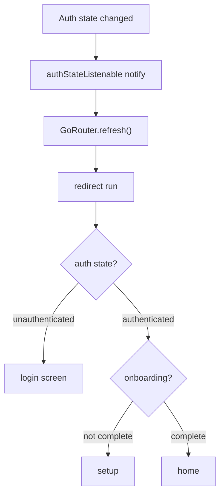
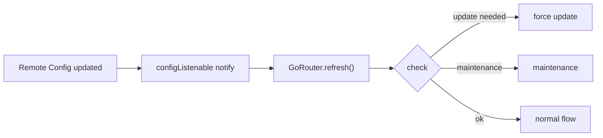
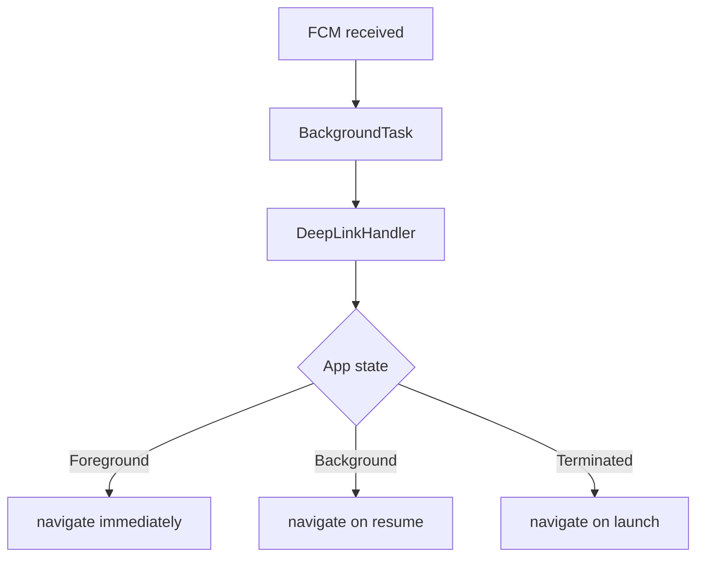
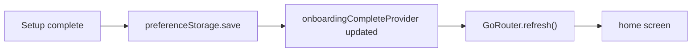
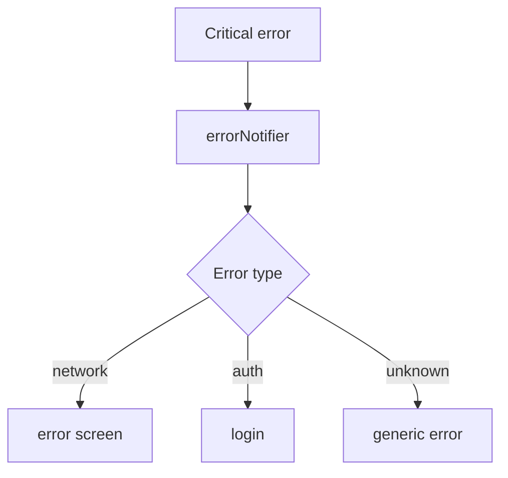

# Routing Implementation Plan

## Purpose

* **Unified Navigation Foundation** — Centralize all navigation (GoRouter-based), deep links, and push-notification launches for consistent experience regardless of entry point.
* **Multi-stage Guarding** — Transparently enforce 4 sequential guards: authentication, force update, maintenance, onboarding. Auto-redirect to the appropriate screen.
* **Reactive Navigation** — Watch auth state, settings changes, and errors to trigger navigation updates as needed.
* **Type-safe Routing** — Manage routes via a type-safe `AppRoute` enum instead of string paths; parameters are strictly typed and checked.

---

## Domain Knowledge

### Guard Priority & Flow

| Priority | Guard       | Condition                | Redirect Target | Dependency |
| -------- | ----------- | ------------------------ | --------------- | ---------- |
| 1        | ForceUpdate | Version < minRequired    | `/force-update` | config     |
| 2        | Maintenance | Maintenance mode ON      | `/maintenance`  | config     |
| 3        | Auth        | Not authenticated        | `/login`        | auth       |
| 4        | Onboarding  | Initial setup incomplete | `/setup/campus` | storage    |

### Deep Link Integration

| Source          | Flow                                      | Target route after guards | Stack behavior |
| --------------- | ----------------------------------------- | ------------------------- | -------------- |
| URL Scheme      | `passpal://course/12345`                  | `/course/12345/detail`    | Stack push     |
| Universal Links | `https://chukyo-passpal.app/course/12345` | Same as above             | Stack push     |
| FCM Data        | `{deeplink: "/assignments"}`              | `/main/assignments`       | Stack reset    |
| Widget Tap      | via Intent/Activity                       | Relevant timetable cell   | Stack push     |

---

## Scope & Responsibilities

### Included

1. **GoRouter config** — Singleton instance, route definitions, ShellRoute structure.
2. **Type-safe API** — `AppRoute` enum, `TypedGoRoute` extensions, param validation.
3. **Guard Logic** — 4-level redirect logic, ordered priority.
4. **Deep Link Handling** — URL parsing, FCM payload handling, delayed transitions.
5. **Navigation Monitoring** — GA4 integration, screen transition logging, error tracking.
6. **State Restoration** — Restore stack and routes after app restart.
7. **Error Handling** — Safe fallback for invalid routes/parameters.

### Excluded

* Screen implementations (handled per feature).
* Auth logic (`core/auth`).
* Config fetching (`core/config`).
* Push notification receipt (`core/background`).

---

## Architecture

### 1. Route Definitions & Models

**AppRoute enum:**

* Define enum variants for login, onboarding, main (ShellRoute), course detail, and other sections.
* Each holds a path string and a method to generate parametric paths.
* Parameters replace `:paramName` in the path with map values.

**Route parameter model:**

* Use `freezed` for immutable parameter classes.
* Implement factory to build from `pathParameters`.
* Clearly separate required and optional params.

**Navigation state model:**

* Track current path, stack, pending deep link, last transition time.
* Implement as `freezed` immutable object.

### 2. RouterProvider

**GoRouter instance:**

* Implement as a Riverpod keep-alive provider (guarantee singleton).
* Observe auth, config, onboarding status.
* Merge multiple Listenables into `refreshListenable`.
* Enable diagnostic logs in debug.

**Error handling:**

* On error, show `ErrorScreen` with details/location.

**Navigation monitoring:**

* Attach Google Analytics & Sentry observers.

**Global redirect:**

* Use `RouteGuard` provider; run 4-stage guards for all routes.

**Route structure:**

* Login route: redirect to home if authenticated.
* Setup route: redirect to login if unauthenticated.
* Main section: wrap in ShellRoute for common UI.
* Course detail: validate params; on invalid, go to error screen.
* Settings: display as fullscreen dialog.

### 3. Guard Implementation

**RouteGuard class:**

* Accept error notification dependency.
* Sequentially run 4-stage redirect logic.

**Redirect logic flow:**

1. Force update check — if version < min required, go to force update.
2. Maintenance check — if maintenance on, go to maintenance screen.
3. Auth check — if unauthenticated and accessing protected route, go to login (retain original path as param).
4. Onboarding check — if authenticated but onboarding incomplete, go to setup.

**Error handling:**

* Wrap exceptions as `RoutingException` and redirect to error screen.

**Helper methods:**

* Implement version comparison, unprotected route check, setup route check.

### 4. Deep Link Handling

**DeepLinkHandler:**

* Depends on GoRouter, auth state, navigation notifier, error notifier.
* Internally manages pending links.

**Flow:**

1. Parse URL to route path.
2. If unauthenticated, keep link as pending.
3. If authenticated, navigate immediately.

**FCM Data:**

* If payload has `deeplink`, treat as deep link.
* If payload has `action`, process per action.

**URL parsing:**

* For custom scheme (`passpal://`), resolve route from host.
* For universal links, use path directly.
* Return null if invalid URL.

**Navigation:**

* Main tab: stack reset (`go`), others: stack push (`push`).
* Record navigation history.

### 5. Navigation State Management

**NavigationNotifier:**

* Implement as Riverpod state notifier.
* Initial state: root path, stack of one, current timestamp.

**Navigation recording:**

* Add new route to stack (max 10).
* Update current path and last transition time.
* Send event to Firebase Analytics.

**Pending deep links:**

* Provide set/get methods.
* Clear automatically on get.

**NavigationSource enum:**

* Distinguish user tap, deep link, push, programmatic, or guard-driven navigation.

### 6. Analytics Integration

**GoogleAnalyticsObserver:**

* Use Firebase Analytics instance.
* Set function to extract screen name from `RouteSettings`.

**Screen name extraction:**

* Remove query params, get clean path.
* Map static routes via predefined map.
* For dynamic routes (e.g., course detail), match by pattern.
* Record unknown as `'unknown'`.

---

## Integration with Other Cores

### 1. Auth Core (Auth state monitoring)

### 2. Config Core (Maintenance/Force Update)

### 3. Background Core (Push notifications)

### 4. Storage Core (Onboarding state)

### 5. Error Core (Error screen navigation)

---

## Error Handling

### Routing Exception Hierarchy

**Base (RoutingException):**

* Extends `Failure`, has optional `location` field.
* Sealed; only specified subclasses.

**InvalidDeepLinkException:**

* Holds invalid deep link URL.
* Error code: `'INVALID_DEEP_LINK'`.

**GuardException:**

* Records failed guard and location.
* Error code: `'GUARD_FAILED'`.

**RouteNotFoundException:**

* Records access to non-existent route.
* Error code: `'ROUTE_NOT_FOUND'`.

---

## Testability

### Mock Router

**MockGoRouter:**

* Maintains navigation history list.
* Overrides `go` and `push` to record history.
* Enables debug logging.

**Test examples:**

* Auth guard test: access protected route unauthenticated, verify redirect to login.
* Inject mock state via `ProviderContainer`.
* Assert `location` after navigation.

### Deep Link Test

**Test contents:**

* Process deep link URL, verify correct route.
* Check navigation history record.
* Confirm record with `NavigationSource.deepLink`.

---

## Metrics & Monitoring

### Key metrics

* Screen transition time (route resolve + build)
* Guard processing time (per guard)
* Deep link success rate
* Error screen display frequency
* Stack depth distribution

### Performance Monitoring Integration

**PerformanceTracking:**

* Create trace in Firebase Performance.
* Record from/to routes and method as attributes.
* Wait 100ms after navigation before stopping trace.
