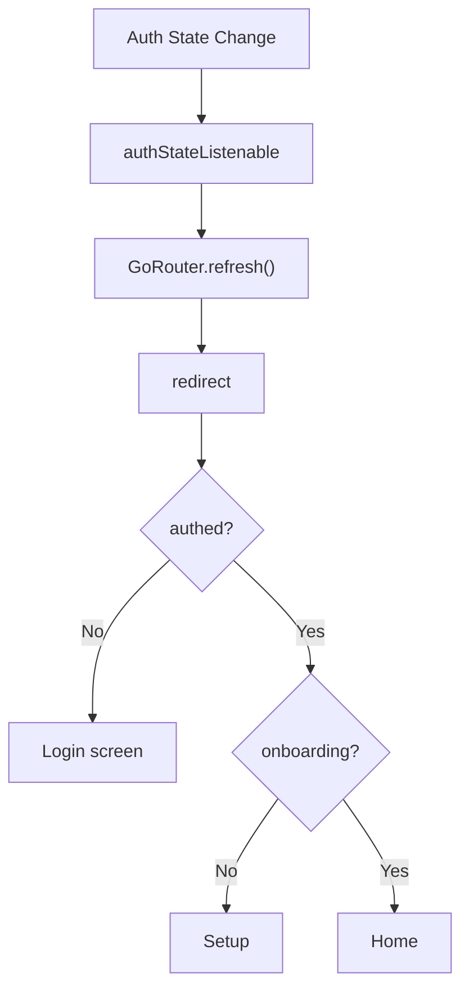
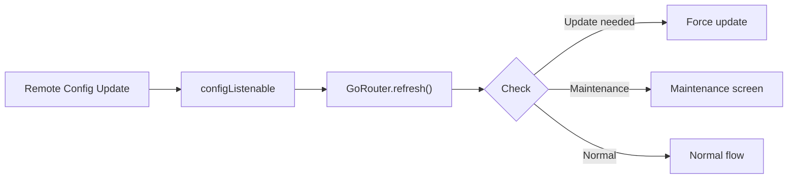
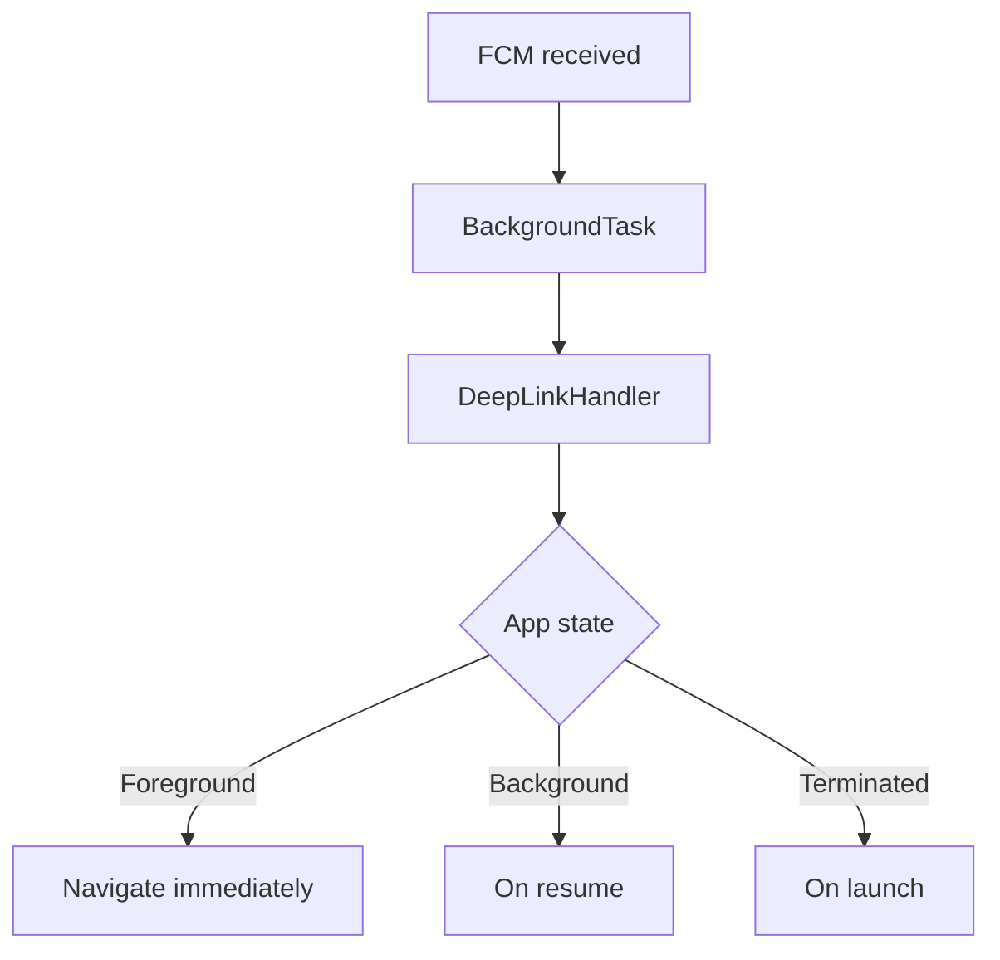
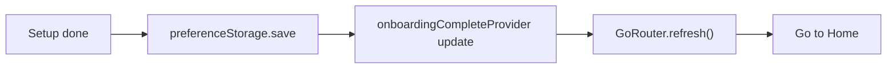
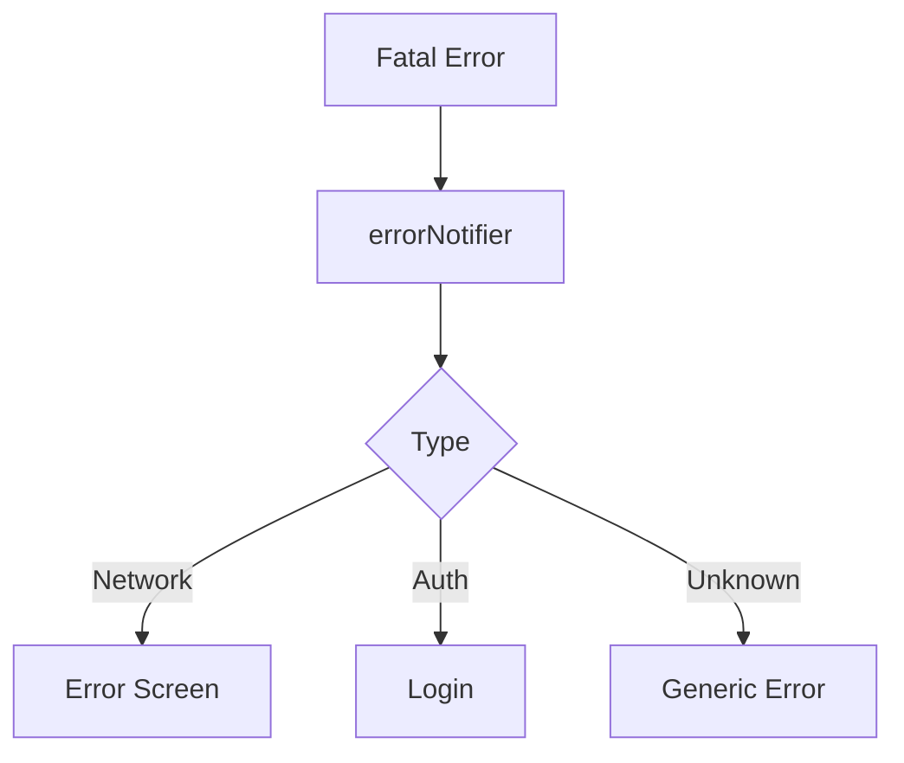

# Routing Implementation Plan

## Purpose

* **Unified Navigation Base**: Centralize all navigation (GoRouter), deep linking, push-notification launches. Always provide a consistent experience, regardless of entry point.
* **Multi-Stage Guard**: Transparently run 4-step checks (auth/forced update/maintenance/onboarding), redirecting to the correct screen automatically.
* **Reactive Navigation**: Watch auth state, settings, and errors; trigger navigation automatically when necessary.
* **Type-safe Navigation**: Manage routing with a typed `AppRoute` enum, not string paths; all parameters strictly typed.

---

## Domain Knowledge

### Guard Priority & Flow

| Priority | Guard Type           | Condition                | Redirect To         | Core    |
| -------- | -------------------- | ------------------------ | ------------------- | ------- |
| 1        | **ForceUpdateGuard** | Version < Min required   | `/force-update`     | config  |
| 2        | **MaintenanceGuard** | Maintenance mode enabled | `/maintenance`      | config  |
| 3        | **AuthGuard**        | Not authenticated        | `/login/student-id` | auth    |
| 4        | **OnboardingGuard**  | Onboarding not finished  | `/setup/campus`     | storage |

### Deep Link Integration

| Source         | Flow                                   | Final Route            | Stack Handling |
| -------------- | -------------------------------------- | ---------------------- | -------------- |
| URL Scheme     | e.g. `passpal://course/12345/detail`   | `/course/12345/detail` | Add to stack   |
| Universal Link | e.g. `https://.../course/12345/detail` | `/course/12345/detail` | Add to stack   |
| FCM data       | `{deeplink: "/assignments"}`           | `/assignments`         | Stack reset    |
| Widget tap     | Via Intent/Activity                    | Go to timetable cell   | Add to stack   |

---

## Responsibilities and Scope

### Included

1. **GoRouter setup**: singleton instance, route/shell structure.
2. **Type-safe API**: `AppRoute` enum, `TypedGoRoute`, parameter validation.
3. **Guards**: 4-step redirect logic, priority controlled.
4. **Deep Link Handling**: URL parsing, FCM payload, delayed navigation.
5. **Navigation Observing**: GA4 integration, transition logs, error tracking.
6. **State Restoration**: Restore stack/routes on app restart.
7. **Error Handling**: Fallback on invalid route/params.

### Not Included

* Screen UI (handled per-feature).
* Auth logic (`core/auth`).
* Config fetching (`core/config`).
* Push notification receipt (`core/background`).

---

## Architecture

### 1. Route Definitions & Models

**AppRoute Enum**:

* Enum covers login, onboarding, main (shell), course details, etc.
* Each route stores its path and exposes param-building methods.
* Param replacement done via colon-prefixed param names.

**Route Parameter Model**:

* Use `freezed` for immutable param classes.
* Factory to create from `pathParameters`.
* Separate required/optional params.

**Navigation State Model**:

* Stores current path, stack, pending deep links, last transition time.
* Immutable with `freezed`.

### 2. RouterProvider

**GoRouter Singleton**:

* Provided via Riverpod (keep alive).
* Watches auth, config, onboarding state.
* Combines multiple Listenables for refreshListenable.
* Debug logging in debug mode.

**Error Handling**:

* Show ErrorScreen on exceptions, display error/location.

**Navigation Observer**:

* Google Analytics and Sentry observers attached.

**Global Redirect**:

* RouteGuard provider checks all four guard stages.

**Route Structure**:

* Login routes redirect to home if authed.
* Setup routes redirect to login if not authed.
* Main section wrapped by ShellRoute.
* Course detail validates params, redirects to error if invalid.
* Settings shown as fullscreen dialog.

```
/  
├─ login/  
│  ├─ student-id  
│  ├─ google  
│  └─ passwd → /setup/campus  
├─ setup/  
│  ├─ campus  
│  ├─ notification  
│  └─ start → /home
├─ home  
├─ timetable/  
│  ├─ day  
│  └─ week  
├─ bus  
├─ settings  
├─ course/  
│  ├─ :courseId/  
│  │  ├─ detail  
│  │  └─ materials  
│  └─ assignments  
├─ maintenance  
├─ force-update  
└─ error  
```

### 3. Guards

**RouteGuard Class**:

* Receives error notifier via DI.
* Runs 4-step redirect in order:

1. Force update: if version < min, go to force update.
2. Maintenance: if enabled, go to maintenance.
3. Auth: if unauthenticated & route protected, go to login (save intended path).
4. Onboarding: if authed but not setup, go to onboarding.

* All exceptions are wrapped as `RoutingException` and redirect to error screen.
* Helper methods: version comparison, unprotected route check, setup route check.

### 4. Deep Linking

**DeepLinkHandler**:

* Depends on GoRouter, auth, navigation notifier, error notifier.
* Manages pending links internally.

**Flow**:

1. Parse URL to route path.
2. If unauthenticated, hold as pending.
3. If authed, navigate immediately.

* FCM: if `deeplink` key, treat as deep link; if `action`, custom handling.
* URL Parsing:

  * Custom scheme: use host/route.
  * Universal: use path directly.
  * Invalid URL returns null.
* Main tab: use `.go` (stack reset), others: `.push`.
* Log navigation history.

### 5. Navigation State

**NavigationNotifier**:

* Riverpod state class.

* Stores current path, stack (max 10), last transition time.

* Adds new routes to stack, updates current path/time, sends event to Firebase Analytics.

* Methods to set/get/clear pending deep link.

* `NavigationSource` enum: user tap, deep link, push notification, programmatic, guard.

### 6. Analytics

**GoogleAnalyticsObserver**:

* Uses Firebase Analytics instance.

* Extracts screen name from RouteSettings.

* Logic:

  * Remove query params, get clean path.
  * Static routes: pre-mapped.
  * Dynamic routes: pattern match.
  * Unknown routes: 'unknown'.

---

## Core Integration Flows

### 1. Auth Core



### 2. Config Core



### 3. Background Core



### 4. Storage Core



### 5. Error Core



---

## Error Handling

**RoutingException** (base, sealed):

* Inherits Failure, optional `location` field.

* **InvalidDeepLinkException**: for invalid deep link, code 'INVALID\_DEEP\_LINK'.

* **GuardException**: failed guard type/location, code 'GUARD\_FAILED'.

* **RouteNotFoundException**: for non-existent route, code 'ROUTE\_NOT\_FOUND'.

---

## Testability

**MockGoRouter**:

* Keeps a navigation history list.
* Overrides `.go` and `.push` to record history, debug log.

**Test Examples**:

* Auth guard test: check unauthenticated user is redirected to login when accessing protected route.
* Inject mock state with ProviderContainer.
* Validate final location after navigation.

**Deep Link Test**:

* Feed deep link URL, check navigation to correct route.
* Validate navigation history and source is `deepLink`.

---

## Metrics Monitoring

**Key Metrics**:

* Route transition time (route resolve + build)
* Guard execution time (per guard)
* Deep link success rate
* Error screen frequency
* Stack depth distribution

**Performance Monitoring**:

* Trace transitions with Firebase Performance.
* Record from, to, method as attributes.
* Wait 100ms after navigation completes, then stop trace.
