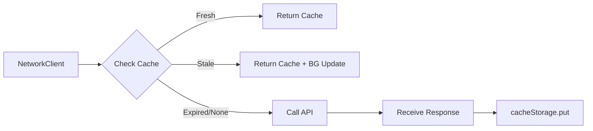
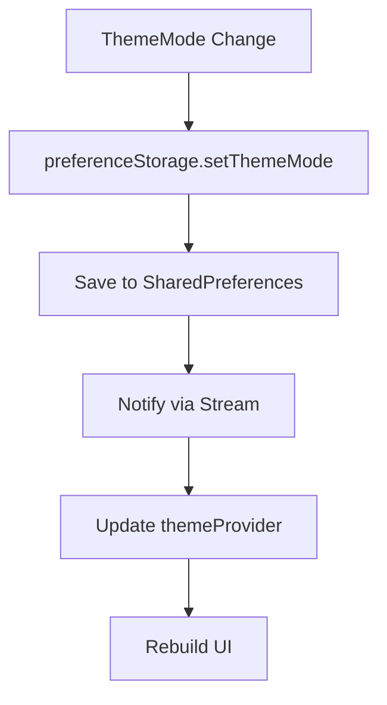
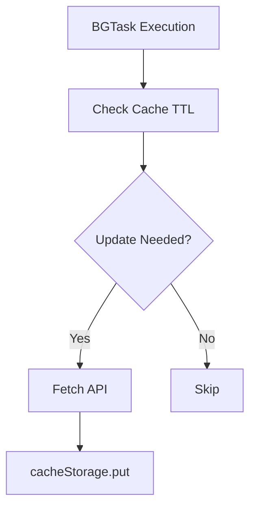
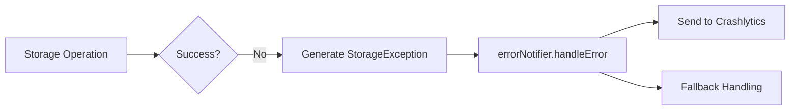

# Storage Implementation Plan

## Purpose

* **Unified Persistence Platform:** Securely and efficiently store authentication data, cache, and user preferences, providing a consistent storage API across all app cores.
* **Type-safe Read/Write:** Minimize runtime errors by using immutable models via Freezed and JSON serialization.
* **Reactive Monitoring:** Instantly reflect storage changes in the UI via Riverpod's StreamProvider.

---

## Domain Knowledge

### Storage Layers and Usage

| Layer                 | Implementation           | Usage                                   | Encryption                              | Related Core        |
| --------------------- | ------------------------ | --------------------------------------- | --------------------------------------- | ------------------- |
| **SecureStorage**     | flutter\_secure\_storage | Credentials, cookies, confidential data | AES-256 (iOS Keychain/Android Keystore) | auth                |
| **CacheStorage**      | SharedPreferences        | API responses, master data              | None (JSON serialization)               | network, background |
| **PreferenceStorage** | SharedPreferences        | Theme, notifications, campus info       | None                                    | theme, config       |

### TTL Management and SWR Strategy

| Data Type             | TTL    | Update Timing                   | SWR | Notes                |
| --------------------- | ------ | ------------------------------- | --- | -------------------- |
| Timetable             | 24h    | BGTask every 6h + widget launch | Yes | Display priority     |
| Cancelled Classes     | 1h     | User action + Push notification | Yes | Real-time priority   |
| Bus Timetable         | 3 days | BGTask                          | Yes | Low update frequency |
| Assignments/Materials | -      | User action + Push + BGTask     | Yes | High importance      |
| Notifications         | 1h     | User action                     | Yes | -                    |
| Attendance            | -      | User action                     | Yes | Accuracy priority    |

---

## Responsibilities and Scope

### Included

1. **SecureStorage Abstraction:** Encrypted saving, loading, and deletion of credentials.
2. **Cache Management:** TTL-based validity, SWR strategy, and auto-deletion.
3. **Preference Management:** Persistent app settings, default value control, migration.
4. **Streaming:** Real-time storage change notification.
5. **Error Handling:** Proper exception conversion and fallback on read/write failure.
6. **Capacity Management:** Monitor cache size and auto-cleanup.

### Excluded

* Data fetching logic (handled by `core/network`)
* Background update scheduling (handled by `core/background`)
* Validation of settings (handled by `core/config`)
* UI state management (handled by presentation layer)

---

## Architecture

### 1. Base Interfaces

Cache entry models are defined as immutable objects with data payload, timestamp, TTL, and ETag, offering expiration judgment methods. JSON conversion enables safe serialization/deserialization of arbitrary types.

### 2. SecureStorage Implementation

The SecureStorage interface defines four main operations: read, write, delete, and delete all. The implementation uses flutter\_secure\_storage, storing data in the iOS Keychain/Android Keystore with AES-256 encryption. For iOS, data is set to be accessible after the first device unlock.

### 3. CacheStorage Implementation

The CacheStorage interface offers type-safe read/write, stream observation, invalidation, and clear operations. The implementation uses SharedPreferences with namespaced keys. Data is always wrapped in a CacheEntry with TTL and timestamp on save.

The stream function manages a broadcast stream controller per key, notifying all listeners on change. Streams include the initial value, enabling seamless UI updates.

Capacity management monitors cache size; if the 50MB limit is exceeded, entries are deleted by LRU until usage drops to 80%, reducing frequent purges.

### 4. PreferenceStorage Implementation

PreferenceStorage specializes in persisting app settings (theme, campus, notifications, etc.), offering synchronous read and async write methods, plus streams to observe changes.

### 5. Riverpod Provider Definitions

Each storage implementation is provided as a keep-alive Riverpod provider, ensuring single-instance use app-wide.

A dedicated CredentialManager provider centralizes handling of student ID/password/cookies, auto-invalidating itself after save, load, or delete for state refresh.

---

## Integration with Other Cores

### 1. Auth Core Integration (Credential Management)

```mermaid
flowchart TD
    A[auth.login] --> B[Retrieve Credentials]
    B --> C[credentialManager.save]
    C --> D[SecureStorage Save (Encrypted)]
    E[auth.refresh] --> F[credentialManager.build]
    F --> G[SecureStorage Read]
    G --> H[Update Cookie]
    I[auth.logout] --> J[credentialManager.purge]
    J --> K[SecureStorage Full Delete]
```

### 2. Network Core Integration (Cache Usage)



### 3. Theme Core Integration (Setting Storage)



### 4. Background Core Integration (Periodic Updates)



### 5. Error Core Integration (Exception Handling)



---

## Error Handling

### StorageException Hierarchy

All storage exceptions inherit from the Failure class, with four main types: read failure, write failure, serialization failure, and capacity exceeded. Each includes a message, error code, internal exception, and stack trace.

### Error Handling Matrix

| Error Type           | Cause              | Handling                | Retry | User Notification |
| -------------------- | ------------------ | ----------------------- | ----- | ----------------- |
| ReadFailure          | Storage corruption | Return default value    | ×     | None              |
| WriteFailure         | Capacity exceeded  | Delete old cache, retry | ○     | None              |
| SerializationFailure | Model mismatch     | Notify error            | ×     | Toast             |
| CapacityExceeded     | >50MB              | LRU deletion            | Auto  | None              |
| CorruptedData        | Broken JSON        | Delete target key       | ×     | None              |

---

## Migration Strategy

### Schema Version Management

Storage schema version is tracked and migrations are run automatically on app update. The current version and stored version are compared; if different, step-by-step migration logic is executed (e.g., key renaming from v1 to v2). The structure is extensible for future schema changes.

---

## Testability

### Mock Storage

Each storage interface has a corresponding in-memory mock implementation. Tests can override providers with these mocks via ProviderContainer, allowing external-dependency-free storage testing.

---

## Metrics Monitoring

### Key Metrics

* Cache hit rate (by Fresh/Stale/Expired)
* Storage usage and cleanup frequency
* Read/write latency (p50/p95/p99)
* Error occurrence rate (by type)

### Firebase Analytics Integration

Analytics events are emitted on storage operations to monitor performance and errors. For privacy, key names are hashed and only metadata such as data size, TTL, and processing time is sent. On error, operation type and error kind are recorded for fast problem detection and improvement.

